# JAVA基础笔记

## 基础问题

1. JDK的组成
   - JVM虚拟机：运行JAVA程序的地方
   - 核心类库：JAVA已经写好的程序
   - 开发工具： javac,java……
2. JAVA跨平台是什么含义，怎样实现跨平台？
   - 一次编译，处处可用
   - JAVA程序只需要开发一次，就可以在安装了JVM的系统平台上运行
3. Path环境变量
   - 用于配置程序路径，方便在命令行窗口的任意目录启动程序
4. JAVA_HOME环境变量
   - 告诉操作系统JDK安装在了哪里

## 变量

### 变量的作用

- 存储一个数据,可以改变里面存储的数据

### 变量的格式

- 数据类型 变量名称 = 初始值

### 注意事项

1. 先声明再使用
2. 声明后，不能在存储其他类型的数据
3. 变量的有效范围是从定义到"}"截止，同一个范围内部不能定义两个同名的变量
4. 变量定义的时候可以没有初始值，但使用的时候必须使用初始值

### 字符在计算机中怎么存储的

ASCII编码表，规定了现代英语，数学字符和其他字符对应的数字编号

### 基本类型

|  类型   | 字节数 |      范围      |
| :-----: | :----: | :------------: |
|  byte   |   1    |    -128~127    |
|  short  |   2    |  -32768~32767  |
|  char   |   2    |    -128~127    |
|   int   |   4    | -2^31~2^31 - 1 |
|  float  |   4    |    -128~127    |
|  long   |   8    |    -128~127    |
| doubule |   8    |    -128~127    |
|  bool   |  1bit  |    -128~127    |

## 标识符

- 字符，符号组合起来的名称，用于给类，变量取名

### 标识符的规则

- 由数字，字母和下划线(_)和美元符($)组成
- 不能以数字开头，不能是关键字，区分大小写

### 命名规范

- 变量：首字母小写，驼峰命名
- 类：首字母大写，驼峰命名

## 类型转换

### 自动类型转换

- 类型范围小的变量，可以直接赋值给类型范围大的变量

### 表达式的自动类型转换

- 在表达式中，小范围类型的变量会自动转换成当前加大范围的类型再运算
- 表达式的最终结果类型有表达式中的最高类型决定
- 在表达式中，byte,short,char是直接转换成int类型参与运算的

### 强制类型转换

- 课强行将类型范围大的变量，数据赋值给类型范围小的变量
- 强制类型转换可能造成数据丢失(溢出)
- 浮点型强转成整型，直接丢掉小数部分

## JAVA内存分配

- 栈方法、变量运行时所进入的内存
- 堆new出来的东西在这里开辟空间并产生地址
- 方法区
  字节码文件加载时进入的内存

## this关键字

- 出现在成员方法、构造器中代表当前对象的地址，用于指定访问访问当前对象的成员变量、成员方法
- 哪个对象调用他们，this就代表那个对象

## String

字符串类型，可以定义字符串变量指向字符串，并操作该字符串

### 特点

- String常被称为不可变字符串类型，它的对象在创建后不能被更改(每次修改其实都是产生并指向了新的字符串对象，原来的字符串没有改变)

### 创建字符串对象

- 使用""定义
- 通过String类的构造函数创建对象
  - 创建空白字符串
  - 根据传入内容创建字符串
  - 根据字符数组内容创建字符串
  - 根据字节数组内容创建字符串(输出内容自动转化为对应的字符)
- 两种创建方法的区别
  - 双引号方式创建的对象在字符串常量池中存储同一个(地址相同)
  - 构造函数创建的对象在堆内存中分开存储(地址不同)
- String常用API

|        API         |                描述                 |
| :----------------: | :---------------------------------: |
|      equals()      |            比较字符内容             |
| equalsIgnoreCase() | 忽略大小写比较字符内容,多用于验证码 |
|      length()      |           获取字符串长度            |
|      charAt()      |           获取索引处字符            |
|   toCharArray()    |       把字符串转换为字符数组        |
|    substring()     |         前闭后开截取字符串          |
|     replace()      |         替换字符串中的内容          |
|     contains()     |  检查字符串内容是否包含目标字符串   |
|    startWith()     |      检查字符串内容是否的开头       |
|      split()       | 按传入规则切割字符串，返回字符数组  |

## ArrayList

与数组类似，也是一种容器，用于存储数据

- 特点
  - 大小不固定，启动后可以动态变化，类型也可以选择不固定
- 创建集合对象，添加元素
- 泛型
  在编译阶段约束集合对象只能操作某种数据类型
  - ArrayList\<String> 此集合只能操作字符串类型的元素
  - ArrayList\<integer> 此集合只能操作整型类型的元素
- 常用API

|   API    |                     描述                     |
| :------: | :------------------------------------------: |
|  get()   |              获取索引处的元素值              |
|  size()  |                 获取集合大小                 |
| remove() |         删除索引处元素，并返回该元素         |
| remove() | 直接删除元素，有多个元素时默认删除第一个元素 |
|  set()   |      修改索引处元素的值，返回被修改的值      |

## 构造器

- 作用
  - 初始化类的对象，返回对象地址
- 数量
  - 无参数构造器：初始化对象时，采用默认值
  - 有参数构造器：初始化对象时，可以同时为对象赋值
- 注意事项
  - 任何类定义出来，默认自带无参构造器
  - 定义了有参构造器后，无参数构造器就不存在了，需要自己写无参数构造器

## JavaBean

- 实体类，其对象可以用于在程序中封装数据
- 要求
  - 成员变量使用private修饰
  - 每一个成员变量都有get/set
  - 必须有一个无参数构造器

## static

修饰成员变量，表示该成员变量在内存中只存储一份，可以被访问共享、修改

### 访问格式

类名.静态成员变量名

### 使用情况

表示在线人数等需要被共享的信息

### 静态成员方法

使用static修饰，属于类，建议用类名访问，也可以用对象访问

- 使用场景：以执行一个通用功能为目的，或者需要方便访问，则可以申明成静态方法

### static访问注意实现

- 静态方法只能访问静态成员，不可以直接访问实例成员
- 实例方法可以访问静态成员，也可以访问实例成员
- 静态方法不能出现this关键字

## 代码块

- 类的五大成分之一(成员变量，构造器，方法，代码块，内部类)，定义在类中方法外
- 在JAVA类下，使用{}括起来的代码称为代码块

### 静态代码块

- 格式：static {}
- 特点：通过static关键字修饰，随类的加载而加载，自动触发、只执行一次
- 使用场景：在类加载的时候做一些静态数据初始化的操作，方便后续使用

### 实例代码块

- 格式：{}
- 特点：每次创建对象、调用构造器执行时，都会执行该代码中的代码块，并且在构造器之前执行
- 使用场景：初始化实例资源

## 继承

### 子类是否可以继承父类的私有成员(存在争议)？

- 可以，但无法访问

### 子类是否可以继承父类的静态成员？

- 存在争议
- 子类可以直接使用父类的静态成员(共享)
- 共享并非继承

### 重写

- 子类定义一个与父类声明一样的方法覆盖父类的方法
- 重写方法的名称、形参列表必须与被重写方法一致的名称和参数列表一致
- 私有方法不能被重写
- 子类重写父类方法时，访问权限必须大于或者等于父类(缺省<protected<public)
- 子类不能重写父类的静态方法

### 子类构造器

- 子类中所有构造器默认会先访问父类中的无参构造器，再执行自己(子类在初始化时，可能用到父类中的数据，若父类未初始化，可能无法使用父类中的数据)
- 子类构造器的第一行默认语句是super(),即使不写也存在
- super调用父类构造器来初始化继承自父类的数据
- this和super
  - 子类通过this()去调用本类的其他构造器，本类其他构造器会通过super去手动调用父类的构造器，最终还是会调用父类的构造器
  - this和super都只能放在构造器的第一行，二者不能共存在于一个构造器中

## 权限修饰符

用来控制一个成员能够被访问的范围，可以修饰成员变量，方法，构造器，内部类

### 具体范围

|  修饰符   | 同一个类中 | 同一个包下的类 | 不同包下的子类 | 不同包下的无关类 |
| :-------: | :--------: | :------------: | :------------: | :--------------: |
|  private  |     ✓      |                |                |                  |
|   缺省    |     ✓      |       ✓        |                |                  |
| protected |     ✓      |       ✓        |       ✓        |                  |
|  public   |     ✓      |       ✓        |       ✓        |        ✓         |

## final

关键字，可以修饰方法，类，变量

- 修饰方法时：表明是最终方法，不能再被重写
- 修饰类时：表明该类是最终类，不能再被继承
- 修饰变量时：该变量第一次被赋值后，不能再被赋值

## 常量

使用了public static final修饰的成员变量，必须有初始化值，而且执行过程中其值不能改变

### 作用及好处

可以用于做系统的配置信息，方便程序的维护，同时也能提高可读性

### 常量命名规范

英文单词全大写，多个单词用下划线连接

### 执行原理

编译阶段进行宏替换，把常量用的地方全部替换成真实的字面量

## 枚举

为了做信息的标志和信息的分类

- 格式
  修饰符 enum 枚举名称{
  第一行都是罗列枚举类实例的名称
  }
- 特征
  - 枚举类都是继承了枚举类型：java.lang.Enum
  - 枚举都是最终类，不可以被继承
  - 构造器的构造器都是私有的，枚举对外不能创建对象
  - 枚举类的第一行默认都是罗列枚举对象的名称的
  - 枚举类相当于是多例模式

## 抽象类

可以被子类继承、充当模板的

- 抽象类是用来被继承的，抽象方法是交给子类重写实现
- 如果一个类继承了抽象类，那么这个类必须重写玩抽象类 的全部抽象方法，否则这个类也必须定义成抽象类

### 抽象方法

只有方法签名，没有方法体，使用abstract修饰

- 抽象类无法创建对象
- 类有的成员抽象类都具有
- 抽象类不一定有抽象方法，有抽象方法一定是抽象类
- abstract不能修饰代码块，构造器，变量
- abstract和final的关系
  - 互斥
  - abstract定义的抽象方法作为模板让子类继承，final定义的类不能被继承
  - 抽象方法定义通用功能让子类重写，final定义的方法子类不能重写

### 模板开发模式

- 使用场景：系统中出现同一个功能多处在开发，而该功能中大部分代码是一样的，只有其中部分可能不同的时候

#### 模板开发模式实现步骤

- 把功能定义成一个所谓的模板方法，放在抽象类中，模板方法中只定义通用且能确定的代码
- 模板方法中不能决定的功能定义成抽象方法让具体子类去实现
- 模板方法建议用final修饰(模板方法是给子类使用的，不是让子类重写的，重写后会失效)

## 接口

接口是体现规范的,用抽象的方法定义的一组行为规范

### 接口的定义和特点

- 接口格式如下:

```java
  public intetface 接口名{
    //常量
    //抽象方法
  }
```

- 特点

1. JDK1.8之前接口中只能是抽象方法和常量
2. 接口不能实例化
3. 接口中的成员都是public修饰,写不写都是，目的是为了公开化

### 用法

- 接口是用来被类实现的，实现接口的类叫做实现类。实现类可以理解为所谓的子类，接口是一种特殊的父类

```java
   修饰符 class 实现类 implement 接口1，接口2，接口3,... {

   }
```

- 接口可以被类单实现，也可以被类多实现
- 一个类实现接口，必须重写完接口的全部抽象方法，否则这个类需要定义为抽象类

### 多继承

一个接口可以继承多个接口

### JDK8新增方法

#### 默认方法

- 必须使用default修饰，默认用public修饰
- 默认方法，接口不能创建对象，这个方法过继给了实现类，由实现类的对象调用

#### 静态方法

- 必须使用static修饰，默认用public修饰
- 接口名自己调用

#### 私有方法

- JDK1.9开始支持
- 必须在接口内部才能被访问

### 接口注意事项

- 一个类继承了父类，同时又实现类接口，父类中和接口有同名方法，默认使用父类的方法
- 一个类实现了多个接口，多个接口中存在同名的默认方法，不冲突，这个类重写该方法即可
- 一个接口继承了多个接口，是没有问题的，如果多个接口中存在规范冲突则不能多继承
- 一个类实现多个接口，多个接口中有同样的静态方法不冲突
- 接口无法创建对象

## 多态

同类型的对象，执行同一个行为，会表现出不同的行为特征

- 常见形式

```java
  父类类型 对象名称 = new 子类构造器 
  结口 对象名称 = new 实现类构造 器
```

### *多态成员访问特点*

- 方法调用:编译看左边,运行看右边
- 变量调用:编译看左边,运行看左边(多态侧重行为多态)

### 多态前提

- 有继承/实现关系
- 有父类引用指向子类对象
- 方法重写

### 多态下的引用数据类型转换

- 自动类型转换
- 强制类型转换

  - 可以转换为真正的子类，从而调用子类独有功能
  - 有继承/实现关系的两个类型就可以进行强制转化，编译无问题，但运行时，如果发现强制转化后的类型不行对象真实类型则报错
  - 强转前使用instanceof判断当前对象真实类型，再进行转换

  ```java
    变量名 instanceof 真实类型
  ```

  判断关键字左边的变量指向的对象的真实类型，是否是右边的类型或者是其子类类型，是则返回true，反之返回FALSE.

## 内部类

定义在类里面的类，里面的类可以理解为寄生，外面的类可以理解为宿主

```java
  public class People{
    //内部类
    public class Heart{
    }
  }
```

### 使用场景

- 当一个事物的内部，还有一个部分需要一个完整的结构进行描述，而这个内部的完整的结构又只为外部提供匢，那么整个内部的完整的结构可以选择使用内部类来设计
- 内部类可以方便访问外部类的成员，包括私有成员
- 内部类提供了更好的封装性，内部类本身就可以用private，protected等修饰，封装性可以做更多控制

### 静态内部类

- static修饰，属于外部类本身
- 与普通类一样，只是位置在一个类里面
- 创建格式

```java
  外部类名.内部类名 对象名 = new 外部类名.内部构造器
```

静态内部类可以直接访问外部类的静态成员，但无法直接访问外部类的实例成员，外部类的实例成员必须用外部类对象访问

### 成员内部类

- 无static修饰，属于外部类的对象
- JDK16前，成员内部类不能定义静态成员，JDK16开始也可以定义静态成员了

```java
  public class Outer{
    //成员内部类
    public class Inner{
    }
  }
```

- 成员内部类创建对象的格式：

``外部类名.内部类名 对象名 = new 外部构造器.new 内部构造器``

- 成员内部类中可以直接访问外部类的静态成员(外部类的静态成员只有一份可以被共享访问)
- 成员内部类的实例方法可以直接访问外部类的实例成员(先有外部类对象，才能有成员内部类对象，所以可以直接访问外部类对象的实例成员)

### 局部内部类(鸡肋语法)

### 匿名内部类

一个没有名字的局部内部类，定义在方法汇总稿呢，代码块中、等，方便创建子类对象，简化了代码编写

- 格式：

```java
  new 类|抽象类名|接口命(){
    重写方法;
  }
```

#### 匿名内部类特点

- 匿名内部类是一个没有名字的内部类
- 匿名内部类写出来就会产生一个匿名内部类的对象
- 匿名内部类的对象类型相当于是当前new的那个类型的子类类型

#### 真实场景

- 给按钮添加点击事件

## 包装类

八种基本数据类型对应的引用类型

| 基本数据类型 | 引用数据类型 |
| :----------: | :----------: |
|     byte     |     Byte     |
|    short     |    Short     |
|     int      |   Integer    |
|     long     |     Long     |
|     char     |  Character   |
|    float     |    Float     |
|    double    |    Double    |
|   boolean    |   Boolean    |

> 为什么提供包装类

- JAVA为了实现一切皆对象，为8种基本类型提供了对应的引用类型
- 集合和泛型只支持包装类型，不支持基本数据类型

自动装箱：基本类型的数据和变量可以直接赋值给包装类型的变量
自动拆箱：包装类型的变量可以直接赋值给基本数据类型的变量

### 包装类的特有功能

- 包装类的变量默认值是null,容错率高
- 可以吧基本类型的数据转换成字符串类型(作用不大)
  - 调用toString()方法得到字符串结果
  - 调用Integer.toString(基本数据类型)
- 可以把字符串类型的数据转换成真实的数据类型(重点)
  - Intege.parseInt("字符串类型的整数")
  - Double.parseDouble(""字符串类型的小数)

## 正则表达式

### 匹配规则

### 应用

- public String replaceALL(String regex,String newStr)

按照正则表达式匹配的内容进行替换

- public String[] split(String regex)

按照正则表达式匹配的内容进行分割字符串，返回一个字符串数组

## Arrays类概述

数组操作工具类，专门用于操作数组元素

### 常用API

|                             方法名                             |                       说明                       |
| :------------------------------------------------------------: | :----------------------------------------------: |
|            public static String toString(类型[] a )            |                  对数组进行输出                  |
|               public static void sort(类型[] a )               |              对数组进行默认升序排序              |
| public static\<T> void sort(类型[] a,Comparator<? super T> c ) |             使用比较器对象自定义排序             |
|        public static int binarySearch(int[] a,int key )        | 二分搜索数组中的数据，存在返回索引，不存在返回-1 |

### 自定义排序规则

- 设置Comparator接口对应的比较器对象，来制定比较规则

如果左边数据大于右边数据，返回正整数
如果左边数据小于右边数据，返回负整数
如果左边数据等于于右边数据，返回0

```java
Integer[] age1 = {21, 42, 31, 9, 87};
Arrays.sort(age1, new Comparator<Integer>() {
  /*
      参数一：被排序的数组，必须是引用类型
      参数二：匿名内部类对象，代表了一个比较器对象
  */
  @Override
  public int compare(Integer o1, Integer o2) {
      //指定比较器规则
//                if (o1 > o2) {
//                    return 1;
//                } else if (o1 > o2) {
//                    return -1;
//                }
//                return 0;
//                return o1 - o2;     //默认排序规则
      return o2 - o1;     //默认排序规则等同于上面代码
  }
});
```

## 常见算法

### 选择排序

> **选择排序思想**
> 没轮选择当前位置，开始找出后面的较小值与改位置交换
> **选择排序关键**
> 确定需要选择几轮：数组长度-1
> 控制每轮从以前位置为基准，与后面元素选择几次

```java
int[] arr = {6, 1, 4, 3};
for (int i = 0; i < arr.length - 1; i++) {
  for (int j = i + 1; j < arr.length ; j++) {
    if (arr[i] > arr[j]) {
      int temp = arr[i];
      arr[i] = arr[j];
      arr[j] = temp;
    }
  }
}
```

### 二分查找

二分查找性能好，前提是必须排序好的数据

> 二分查找正常的检索条件应该是开始位置min<=结束位置max

```java
/**
*
* @param arr 排序好的数组
* @param data 查找的元素
* @return  索引，若不存在返回-1
*/
public static int binarySearch(int[] arr,int data){
  int left=0;
  int right=arr.length-1;
  while (left<=right){
      int midIndex = (left+right)/2;
      if (data>arr[midIndex]){
          left = midIndex+1;
      }else if (data<arr[midIndex]){
          right=midIndex-1;
      }else {
          return midIndex;
      }
  }
  return -1;
}
```

> 二分查找实现步骤
>
> - 定义变量记录左边和右边位置。
> - 使用while循环控制查询（条件是左边位置<=右边位置）
> - 循环内部获取中间元素索引
> - 判断当前要找的元素如果大于中间元素，左边位置=中间索引+1·判断当前要找的元素如果小于中间元素，右边位置=中间索引-1·判断当前要找的元素如果等于中间元素，返回当前中间元素索引

## Lambda表达式

- 作用：简化匿名内部类的代码写法

简化格式

```java
(匿名内部类被重写方法的形参列表)->{
  被重写方法的方法体代码
}
```

> **注意：Lambda表达式只能简化函数式接口的匿名内部类的写法形式**

什么是函数式接口？

- 首先必须是接口，其次接口中有且仅有一个抽象方法的形式
- 通常我们会在接口上加上一个@FunctionallInterface注解，标记该接口必须是满足函数式接口

```java
@FunctionalInterface //一旦加上这个注解必须是函数式接口，里面只能有一个方法
interface  Swimming{
    void swim();
}
public class LambdaDemo {
    public static void main(String[] args) {
//        Swimming swimming = new Swimming() {        //一般的匿名内部类写法
//            @Override
//            public void swim() {
//                System.out.println("老师在游泳");
//            }
//        };
        Swimming swimming=()->{                     //Lambda表达式
            System.out.println("老师在游泳。。。");
        };
        go(swimming);
  
        System.out.println("------------------------");


        go(()->{                                      //再次简化
            System.out.println("学生正在游泳。。。"); 
        });
    }
    public static void go(Swimming m){Markdown: Open Preview to the Side 
        System.out.println("开始。。。。");
        m.swim();
        System.out.println("结束。。。。");
    }
}
```

> **Lambda表达式的省略写法**
>
> - 参数类型可以省略不写
> - 如果只有一个参数，参数类型和()也可以省略
> - 如果表达式的方法体只有一行代码，可以省略大括号不写，同时省略分号
> - 如果表达式的方法体只有一行代码，可以省略大括号不写，此时，如果这行代码是return语句必须省略return不写，同时也省略";"不写

## 集合

- Collection单列集合，每个元素(数据)只包含一个值
- Map双列集合，每个元素包含两个值(键值对)

> Collection集合特点

- List系列集合：添加的元素是有序的，可重复、有索引
  - ArrayList、LinekdList:有序，可重复、有索引
- Set系列集合：添加的元素是无序的，不重复、无索引
  - HashSet：无序，不重复、无索引
  - LinkHashSet：有序，不重复、无索引
  - TreeSet：按照大小默认升序排序，不重复、无索引

### 集合对于泛型的支持

- 集合都是支持泛型的,可以在编译阶段约束集合只能操作某种数据类型

```java
Collection<String> lists = new ArrayList<String>();
Collection<String> lists = new ArrayList<>(); //JDK1.7开始后面的残血类型申明可以省略
```

> **注意：集合和泛型都只能支持引用数据类型，不支持基本数据类型，所以集合中存储的元素都认为是对象**

如果集合中要存储基本类型的数据，可以使用包装类

```java
//存储基本类型使用包装类
Collection<Integer> lists = new ArrayList<>();
Collection<Double> lists = new ArrayList<>();
```

### Collection集合

#### Collection集合常用API

Collection是单列集合的父接口，他的功能时全部单列集合都可以继承使用的

|              方法名称               |               说明               |
| :---------------------------------: | :------------------------------: |
|       public boolean add(E e)       |   把给定的对象添加都当前集合中   |
|         public void clear()         |       清空集合中所有的元素       |
|     public boolean remove(E e)      |   把给定的对象在当前集合中删除   |
| public boolean contains(Object obj) | 判断当前集合中是否包含给定的对象 |
|      public boolean isEmpty()       |       判读当前集合是否为空       |
|          public int size()          |       返回集合中元素的个数       |
|      public Object[] toArray()      |    把集合中的元素存储到数组中    |

#### Collection集合的遍历方式

##### 迭代器遍历

迭代器在JAVA中的代表是Iterator，迭代器是集合的专用遍历方式

> **Collection集合获取迭代器**

| 方法名称                  |                             说明                             |
| ------------------------- | :----------------------------------------------------------: |
| Iterator `<E> iterator()` | 返回集合中的迭代器对象，该迭代器对象 默认指向当前集合的0索引 |

> **Iterator中的常用方法**

| 方法名称          | 说明                                                                   |
| ----------------- | ---------------------------------------------------------------------- |
| boolean hasNext() | 询问当前位置是否有元素存在，存在返回true,不存在返回false               |
| E next()          | 获取当前位置的元素，并同时将迭代器对象移向下一个位置，注意防止取出越界 |

##### foreach/增强for循环

- 增强for循环既可以遍历集合也可以遍历数组
- 自JDK5之后出现的,内部原理是一个Iterator迭代器(无法遍历数组)，遍历集合相当于是迭代器的简化写法
- 实现Iterable接口的类才可以使用迭代器和增强for，Collection接口已经实现了Iterable接口

遍历格式

```java
for(元素数据类型 变量名:数组或者Collection集合){
 //此处操作变量
}
```

##### 使用Lambda表达式

| 方法                                             | 说明               |
| ------------------------------------------------ | ------------------ |
| default void forEach(Consumer<? super T> action) | 结合Lambda遍历集合 |

```java
//遍历数组list中的各个元素
list.forEach(new Consumer() {   //最基础形式
            @Override
            public void accept(Object o) {
                System.out.println(o);
            }
        });
list.forEach(o->System.out.println(o));  //简化
list.forEach(System.out::println);    //再次简化
```

> **集合中存储的是对象的地址**

### List系列集合

#### List系列集合特点

- 有序，可重复，有索引

  - 有序：存储和取出的元素顺序一致
  - 有索引：可以通过索引操作元素
  - 可重复：存储的元素可以重复

#### List系列集合特有方法

| 方法                          |                  说明                  |
| ----------------------------- | :------------------------------------: |
| void add(int index,E element) |   在此集合中的指定位置插入指定的元素   |
| E remove(int index)           | 删除指定索引处的元素，返回被删除的元素 |
| E set(int index，E element)   | 修改指定索引处的元素，返回被修改的元素 |
| E get(int index)              |          返回指定索引处的元素          |

#### List集合遍历方式

- 增强for循环
- 迭代器
- Lambda表达式
- for循环(List集合存在索引)

#### ArrayList集合底层原理

- ArrayList底层是基于数组实现的：根据索引定位元素快，增删需要做元素的移位操作
- 第一次创建集合并添加第一个元素的时候，在底层创建一个默认长度为10的数组

#### LinkedList集合原理

- 特点：底层数据结构是双链表、查询慢，首尾操作的速度是极快的，所以多了很多首尾操作的特有API

##### 特有功能

| 方法                      |               说明               |
| ------------------------- | :------------------------------: |
| public void addFirst(E e) |    在该列表开头插入指定的元素    |
| public void addLast(E e)  |  将指定的元素追加到此列表的末尾  |
| public E getFirst()       |     返回此列表中的第一个元素     |
| public E getLast()        |    返回此列表中的最后一个元素    |
| public E removeFirst()    |  从此列表中删除并返回第一个元素  |
| public E removeLast()     | 从此列表中删除并返回最后一个元素 |

## 常见数据结构

- 栈
  特点：先进后出，后进先出
- 队列
  特点：先进先出，后进后出
- 数组

  - 查询速度快：查询数据通过地址值和索引定位，查询任意数据耗时相同(元素在内存中是连续存储到)
  - 删除效率低：要将原始数据删除，同时后面每个数据都要前移
  - 添加效率极低：添加位置后的每个数据后移，再添加元素
- 链表

  - 元素在内存中不连续存储，每个元素节点包含数据值和下一个元素的地址
  - 链表查询慢：无论查询那个元素都要从头结点开始
  - 增删相对快
- 二叉树

  - 只能有一个根节点：每个节点最多支持2个直接子节点
  - 节点的度：节点拥有子树的个数，二叉树的度不大于2，叶子节点度为0的节点，也称为终端节点
  - 高度：叶子节点的高度为1，叶子节点的父节点高度为2，以此类推，根节点的高度最高
  - 根：根节点在第一层，以此类推
  - 兄弟节点：拥有共同父节点的节点互称兄弟节点
  - 二叉查找树/二叉排序树/二叉搜索树

    - 每一个节点上最多有两个子节点
    - 左子树上所有的节点的值都小于根节点的值
    - 右子树上所有节点的值都大于根节点的值
    - 提高了检索数据的性能
  - 平衡二叉树

    - 任意节点的左右两个子树的高度差不超过1，任意节点的左右两个子树都是一颗平衡二叉树
  - 红黑树

    - 一种自平衡二叉查找树
    - 每一个节点可以是红或者黑；不通过高度平衡，它的平衡通过“红黑规则”进行实现
    - 红黑规则
      - 每一个节点或是红色的，或者是黑色的，根节点必须是黑色
      - 如果一个阶段没有字节的或者父节点，则该阶段相应的指针属性值为Nil，这些Nil视为叶结点，叶结点是黑色的
      - 如果某一个节点是红色，那么他的字节的必须是黑色(不能出现两个红色节点相连的情况)
      - 对每一个节点，从该节点到其所有后代叶结点的简单路径上，君宝喊相同数目的黑色节点
    - 增删改查性能都很好

## 泛型深入

### 泛型概述

- 泛型：是JDK5中引入的特性，可以在编译阶段约束操作的数据类型，并进行检查
- 泛型的格式：<数据类型>；**注意：泛型只能支持引用数据类型**
- 集合体系的全部接口和实现类都是支持泛型的使用的

### 泛型的好处

- 统一数据类型
- 把运行事情的问题提前到了编译期间，避免了强制类型转换可能出现的异常，因为编译阶段类型就能确定下来

### 自定义泛型类

#### 泛型类的概述

- 定义类时同时定义了泛型的类就是泛型类
- 泛型类的格式：修饰符 class 类型<泛型变量>{}

  范例: ```public class MyArrayList<T>{}```

- 此处泛型变量T可以随便写为任意标识《常见的如E、T、K、V等
- **作用：编译阶段可以指定数据类型，类似于集合的作用**

#### 泛型类的核心思想

- 把出现泛型变量的地方全部替换成传输的真实数据类型

### 自定义泛型方法

- 定义方法时同时定义了泛型的方法就是泛型方法
- 格式：修饰符<泛型变量> 方法返回值 方法名称(形参列表){}  
  范例：```public <T> void show (T t){}```
- **作用：方法中可以使用泛型接受一切实际类型的参数，方法更具备通用性**

### 自定义泛型接口

- 使用了泛型定义的接口就是泛型接口
- 格式：修饰符 interface 接口名称<泛型变量>{}

  范例：```public interface Data<E> {}```

- **作用：泛型接口可以让实现类选择当前功能需要操作的数据类型，泛型接口可以约束实现类，实现类可以在实现接口的时候传入自己操作的数据类型，这样重写的方法都是针对与该类型的操作**
- 原理：实现类可以在实现接口的时候传入自己操作的数据类型，这样重写的方法都是针对与该类型的操作

### 泛型通配符

#### 通配符：？

- ？ 可以在"使用泛型"的时候代表一切类型
- Ｅ　Ｔ　Ｋ　Ｖ是在定义泛型的时候使用的

#### 泛型的上下限

- ```? extends Car```:必须是Car或者其子类 泛型上限
- ```? super Car```:必须是Car或者其父类 泛型下限

## Set系列集合

### Set集合特点

- 无序：存取顺序不一致
- 不重复：可以去除重复
- 无索引：没有带索引的方法，所以不能使用普通for循环遍历，也不能通过索引来获取元素

### Set集合实现类特点

- HashSet：无序，不重复，无索引
  - LinkedHashSet：**有序**，不重复，无索引
- TreeSet：**排序**，不重复，无索引

> **Set集合的功能上基本与Collection的API一致**

### HashSet底层原理

- HashSet集合底层采取哈希表存储到数据
- 哈希表是一种对于增删改查数据性能都较好的结构

### 哈希表的组成

- JDK8之前的，底层使用**数组+链表**组成
- JDK8之前的，底层使用**数组+链表+红黑树**组成

在了解哈希表之前需要先理解哈希值的概念

#### 哈希值

- 是JDK根据对象的地址，按照某种规则算出来的int类型的数值，object类中的API ```public int hashCode()```可以返回对象的哈希值

#### 对象哈希值的特点

- 同一个对象多次调用hashCode()方法返回的哈希值是相同的
- 默认情况下，不同对象的哈希值是不同的

#### 1.7版本原理解析

1. 创建一个默认长度为16的数组
2. 根据元素的哈希值根数组的长度求余计算出应存入的位置(哈希算法)
3. 判断当前位置是否为null，如果是null直接存入
4. 如果位置不为null，表示有元素，则调用equals方法比较，如果一样，则不存，如果不一样，则存入数组
   - JDK7新元素占老元素位置，指向老元素
   - JDK8中新元素挂在老元素下面

#### 1.8版本原理解析

- 底层结构：哈希表(数组，链表，红黑树的结合体)
- 当挂载元素下面的数据过多时，查询性能降低，从JDK8开始后，当链表 长度超过8的时候，自动转换为红黑树

#### HashSet去重复原理解析

1. 创建一个默认长度为16的数组
2. 根据元素的哈希值根数组的长度求余计算出应存入的位置(哈希算法)
3. 判断当前位置是否为null，如果是null直接存入
4. 如果位置不为null，表示有元素，则调用equals方法比较，如果一样，则不存，如果不一样，则存入数组

> 如果希望Set集合认为两个内容相同的对象是重复的，需要重写对象的hashCode和equals方法

### TreeSet集合

- 不重复，无索引，可排序
- 可排序：按照元素大小默认升序(由小到大)排序
- TreeSet集合底层是基于红黑树的数据结构实现排序的，增删改查性能都较好
- **注意：TreeSet集合是一定要排序的，可以将元素按照知道的规则进行排序**

#### TreeSet集合默认规则

- 对于数值类型：Integer，Double，官方默认按照大小进行升序排序
- 对于字符串类型：默认按照首字符的编号进行升序排序
- 对象自定义对象，无法直接排序

> **想要使用TreeSet存储自定义类型，需要制定排序规则**

- 自定义排序规则
  - 方式一：让自定义的类实现Comparable接口重写里面的compareTo方法来制定比较规则

    ```java
    public class Student implements Comparable<Student> {
      ...
      @Override
      public int compareTo(Student o) {
          return this.age - o.age >= 0 ? 1 : -1;//通过年龄进行排序
      }
    }
    ```

  - 方式二：TreeSet集合有参数构造器，可以设置Comparator接口对应的比较器对象，来制定比较规则
  
   ```java
    public static void main(String[] args) {
      Set<Student> students = new TreeSet<>(new Comparator<Student>() {
          @Override
          public int compare(Student o1, Student o2) {
              return o1.getAge() - o2.getAge() > 0 ? 1 : -1;
          }
      });
      //使用Lambda表达式简化为下
      //Set<Student> students = new TreeSet<>((o1, o2) -> o1.getAge() - o2.getAge() > 0 ? 1 : -1);
      ...
    }
   ```

两种方式中，关于返回值的规则：

- 如果认为第一个元素大于第二个元素返回正数即可
- 如果认为第一个元素小于第二个元素返回负数即可
- 如果认为第一个元素等于第二个元素返回0即可，此时TreeSet集合只会保留一个元素，认为两者重复

> **注意：如果TreeSet集合存储的对象有实现比较规则，集合也自带比较器，默认使用集合自带的比较器排序**

---
> 1.如果希望元素可以重复又有索引，索引查询要快，**用ArrayList集合，基于数组的**  
> 2.如果希望元素可以重复又有索引，增删首尾操作快，**用LinkedList集合，基于链表的**  
> 3.如果希望元素不重复，无序，无索引，增删改查都快，**用HashSet集合，基于哈希表的**  
> 4.如果希望元素不重复，有序，无索引，增删改查都快，**用LinkedHashSet集合，基于哈希表和双链表**  
> 5.如果要对对象进行排序，**用TreeSet集合，基于红黑树**  

## 可变参数

- 可变参数在形参中可以接收多个数据
- 可变参数的格式：```数据类型...参数名称```

### 作用

- 传输参数非常灵活，方便，可以不传输参数，可以传输1个或者多个，也可以传输一个数组
- **可变参数在方法内部本质上是一个数组**
  
### **注意事项**

- 一个形参列表中可变参数只能有一个
- 可变参数必须放在形参列表的最后面

## Collections集合工具类

- java。utils.Collections：是集合工具类
- 作用：Collections不属于集合，是用来操作集合的工具类

---

- 常用API

|                                 方法名称                                 |          说明          |
| :----------------------------------------------------------------------: | :--------------------: |
| public static \<T> boolean addAll(Collection<? spuer T> c, T...elements) | 给集合对象批量添加元素 |
|                 public static void shuffle(List<?> list)                 | 打乱List集合元素的顺序 |

- 排序相关API(只能对于List集合的排序)
  - 方式一：
    |                  方法名称                   |             说明             |
    | :-----------------------------------------: | :--------------------------: |
    | public static \<T> void sort(List\<T> list) | 将集合中元素按照默认规则排序 |
    > **注意：此方式不能直接对自定义类型的List集合排序，触发自定义类型实现类比较规则Comparable接口**

  - 方式二：
    |                              方法名称                               |             说明             |
    | :-----------------------------------------------------------------: | :--------------------------: |
    | public static \<T> void sort(List\<T> list,Compatator<? super T> c) | 将集合中元素按照指定规则排序 |

## Map集合体系

- Map集合是一种双列集合，每个元素包含了两个数据
- Map集合的每个元素的格式:key=value(键值对元素)
- Map集合也被称为"键值对集合"
- Map集合的完整格式：{key1=value1,key2=value2,key3=value3,key4=value4,...}

### Map集合体系特点

- Map集合的特点都是由键决定的
- Map集合的键是无序，不重复，无索引的，值不作要求(可以重复)
- Map集合后面重复的键对应的值会覆盖前面重复键的值
- Map集合的键值对都可以为null

### Map集合实现类特点

- HashMap：元素按照键是无序，不重复，无索引，值不作要求
- LinkedHashMap:元素按照键是有序，不重复，无索引，值不作要求
- TreeMap:元素按照键是排序，不重复，无索引，值不作要求

### Map API如下

|              方法名称               |                 说明                 |
| :---------------------------------: | :----------------------------------: |
|        V put(K key,V value)         |               添加元素               |
|        V remove(Object key)         |         根据键删除键值对元素         |
|            void clear()             |         移除所有的键值对元素         |
|   boolean containsKey(Object key)   |       判断集合是否包含指定的键       |
| boolean containsValue(Object value) |       判断集合是否包含指定的值       |
|          boolean isEmpty()          |           判断集合是否为空           |
|             int size()              | 集合的长度，也就是集合中键值对的个数 |

### 遍历Map

#### 遍历方式一：键找值

- 先获取Map集合的全部键的Set集合
- 遍历键的Set集合，然后通过键提取对应值

涉及API：

|     方法名称      |       说明       |
| :---------------: | :--------------: |
| Set\<K> keySet()  | 获取所有键的集合 |
| V get(Object key) |   根据键获取值   |

```java
Set<String> strings = maps.keySet();
for (String string : strings) {
    Integer v = maps.get(string);
    System.out.println(string+"===>"+v);
}
```

#### 遍历方式二：键值对

- 先把Map结果转换成Set集合，Set集合中每个元素都是键值对实体类型了
- 遍历Set集合，然后提取键已经提取值

涉及API：

|           方法名称            |           说明           |
| :---------------------------: | :----------------------: |
| Set<Map.Entry<K,V>>enterSet() | 获取所有键值对对象的集合 |
|          K getkey()           |          获的键          |
|         V getValue()          |          获的值          |

```java
Set<Map.Entry<String, Integer>> entries = maps.entrySet();
for (Map.Entry<String, Integer> entry : entries) {
    System.out.println(entry.getKey()+"===>"+entry.getValue());
}
```

#### 遍历方式三：Lambda表达式

API：

|                           方法名称                            |         说明          |
| :-----------------------------------------------------------: | :-------------------: |
| default void forEach(BiConsumer <? super K,? super V> action) | 集合Lambda遍历Map集合 |

```java
maps.forEach(new BiConsumer<String, Integer>() {
            @Override
            public void accept(String k, Integer v) {
                System.out.println(k+"=====>"+v);
            }
});
```

简化为

```java
maps.forEach(( k,  v) ->{System.out.println(k+"=====>"+v);});
```

### HashMap

- HashMap是Map里面的一个实现类，特点都是由键决定的：无序，不重复，无索引
- HashMap和HashSet底层原理是一样的，都是哈希表结构，只是HashMap的每个元素包含两个值
- **实际上：Set系列集合的底层就是Map实现的，只是Set集合中的元素只要键数据,不要值而已**
- 依赖hashCode方法和equals方法保证键的唯一
- 如果键要存储的是自定义对象,需要重写hashCode和equals方法
- 基于哈希表，增删改查的性能都较好

### LinkedHashMap

- 由键决定的：有序，不重复，无索引
- 保证存储和取出的元素顺序一致
- 原理：底层数据结构依然是哈希表，只是每个键值对元素有额外多了一个双链表的机制记录存储顺序

### TreeMap集合概述和特点

- 由键决定特性：不重复，无索引，可排序
- 可排序：按照键数据的大小默认升序排序，只能对键排
- **注意：TreeMap集合是一定要排序的，可以默认排序，也可以将键按照指定的规则进行排序**
- TreeMap跟TreeSet底层原理是一样的

## 不可变集合

- 不可修改的集合
- 集合的数据线在创建的时候提供，并且在整个生命周期中都不可添加、修改、删除，否则报错

> 为什么创建不可变集合？
>
> - 如果某个数据不能被修改，把它防御性地拷贝到不可变集合中是个很好的实践
> - 或者当集合对象被不可信的库调用时，不可变的形式是安全的

### 创建不可变集合

- 在List、Set、Map接口中，都存在of方法，可以创建一个不可变的集合

|                 方法名称                  |                说明                |
| :---------------------------------------: | :--------------------------------: |
|  static \<E> List \<E> of(E...elements)   | 创建一个具有指定元素的List集合对象 |
|   static \<E> Set \<E> of(E...elements)   | 创建一个具有指定元素的Set集合对象  |
| static \<K,V> Map \<K,V> of(E...elements) | 创建一个具有指定元素的Map集合对象  |

## Stream流

- 在Java8中，得益于Lambda所带来的函数式编程，引入了一个全新的Stream流概念
- 目的：用于简化集合和数组操作的API

> **Stream流式思想的核心**
>
> 1. 先得到集合或者数组的Stream流
> 2. 把元素放上去
> 3. 然后就用这个Stream流简化的API来方便地操作元素

### 集合获取Stream流的方式

- 使用Collection接口中的默认方法Stream()生成流

|             名称             |            说明            |
| :--------------------------: | :------------------------: |
| default Stream \<E> stream() | 获取当前集合对象的Stream流 |

```java
/*Collection集合获取流*/
Collection<String> list = new ArrayList<>();
Stream<String> listStream = list.stream();

/*Map集合获取流*/
Map<String,Integer> map = new HashMap<>();
Stream<String> keyStream = map.keySet().stream();       //键流
Stream<Integer> valueStream = map.values().stream();    //值流
Stream<Map.Entry<String, Integer>> mapStream = map.entrySet().stream();     //拿整体的键值对流
```

### 数组获取Stream流的方式

|                       名称                       |              说明               |
| :----------------------------------------------: | :-----------------------------: |
| public static \<T> Stream \<T> stream(T[] array) |     获取当前数组的Stream流      |
|  public static \<T> Stream \<T> of(T... values)  | 获取当前数组/可变数据的Stream流 |

```java
String[] array={"A","B"};
Stream<String> arrayStream = Arrays.stream(array);
Stream<String> stringStream = Stream.of(array);
```

#### Stream流的常用API(中间操作方法)

|                       名称                        |                     说明                     |
| :-----------------------------------------------: | :------------------------------------------: |
| Stream\<T> filter(Predicate<? super T> predicate) |           用于对流中的数据进行过滤           |
|          Stream\<T> limit(long maxSize)           |                获取前几个元素                |
|              Stream\<T> skip(long n)              |                跳过前几个元素                |
|               Stream\<T> distinct()               | 去除流中重复的元素，依赖hashCode和equals方法 |
|    Static Stream\<T> concat(Stream a,Stream b)    |            合并a,b两个流为一个流             |

> **注意：中间方法也称为非终结方法，调用完成后返回新的Stream流可以继续使用，支持链式编程**

### Stream流常见终结方法

|             名称              |             说明             |
| :---------------------------: | :--------------------------: |
| void forEach(Consumer action) | 对此流的每个元素执行遍历操作 |
|         long count()          |      返回此流中的元素数      |

### Stream流的收集操作

- 含义：就是把Stream流操作后的结果数据传回到集合或者数组中去

- 收集方法：```R collect(Collector collector)```，开始收集Stream流，指定收集器

- Collectors工具类提供了具体的收集方式

  |                                    名称                                     |          说明          |
  | :-------------------------------------------------------------------------: | :--------------------: |
  |                    public static \<T> Collector toList()                    | 把元素收集到List集合中 |
  |                    public static \<T> Collector toSet()                     | 把元素收集到Set集合中  |
  | public static \<T> Collector toMap(Function keyMapper,Function valueMapper) | 把元素收集到Map集合中  |

> **注意：流只能使用一次**

## 异常处理

异常：程序在编译或者执行的过程中可能出现的问题，比如：数组索引越界，空指针异常，日期格式化异常等......**注意语法错误不算在异常体系中**

### 异常体系

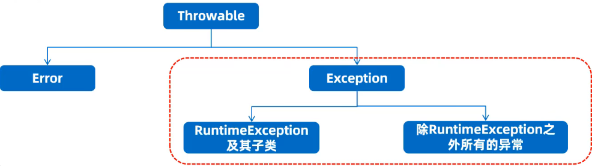

- Error：系统级别问题、JVM退出等，代码无法控制
- Exception：java.lang包下，称为异常类，标识程序本身可以处理的问题
  - RuntimeException及其子类：运行时异常，编译阶段不会报错(空指针异常，数组索引越界异常)
  - 除RuntimeException之外所有的异常：编译时异常，编译期必须处理的，否则程序不能通过编译(日期格式化异常)

#### 运行时异常

- 直接继承自RuntimeException或者其子类，编译阶段不会报错，运行时可能会出现的错误
- 示例：
  - 数组索引越界异常：```ArrayIndexOutOfBoundsException```
  - 空指针异常：```NullPointerException```，直接输出无问题，但调用空指针的变量的功能就会报错
  - 数学操作异常：```ArithmeticException```
  - 类型转换异常：```ClassCastException```
  - 数字转换：```NumberFormatException```

#### 编译时异常

- 不是RuntimeException或者其子类，编译阶段就报错，必须处理，否则代码不通过

> 异常的默认处理机制
>
> 1. 默认会在出现异常的代码那里自动创建一个异常对象：ArithmeticException
> 2. 异常会从方法中出现的点这里抛出给调用这，调用这最终抛出给JVM虚拟机
> 3. 虚拟机接收到异常对象后，先在控制台直接输出异常栈信息数据
> 4. 直接从当前执行的异常点停止当前程序
> 5. 后续代码没有机会执行了，因为程序已经停止  

注意：**默认异常处理机制并不好，一旦真的出现异常，程序立即死亡**

### 编译时异常的处理形式

- 出现异常直接抛出去给调用者，调用者也继续抛出去
- 出现异常自己捕获处理，不麻烦别人
- 前两者结合，出现异常直接抛出去给调用者，调用者捕获异常

### 异常处理方式1---throws

- throws：用在方法上，可以将方法内部出现的异常抛出去给本方法的调用者处理
- 这种方式并不好，发生的异常的方法自己不处理异常，如果异常最终抛出去给虚拟机将引起程序死亡

抛出异常格式

```java
方法 throws 异常1,异常2,异常3..{
}
```

规范做法

```java
方法 throws Exception{
}
```

### 异常处理方式2---try...catch

- 监视捕获异常，用在方法内部，可以将方法内部出现的异常直接捕获处理
- 发生异常的方法自己独立完成异常的处理，程序可以继续往下执行

格式：

```java
try{
  //监视可能出现的异常
}catch(异常类型1 变量){
  //处理异常
}catch(异常类型2 变量){
  //处理异常
}
...
```

建议格式

```java
try{
  //可能出现的异常
}catch(Exception){
  e.printStackTrace();  //直接打印异常
}
```

> Exception可以捕获处理一切异常类型

### 异常处理方式3---前两者结合

- 方法直接将异常通过throws抛出去给调用者
- 调用者收到异常后直接捕获处理

### 自定义异常

- 自定义编译时异常
  - 定义一个异常类继承Exception
  - 重写构造器
  - 在出现异常的地方用throw new 自定义对象抛出

> 作用：编译时异常是编译阶段就报错，提醒更加强烈，一定要处理

- 自定义运行时异常
  - 定义一个异常类继承RuntimeException
  - 重写构造器
  - 在出现异常的地方用throw new 自定义对象抛出

> 作用：提醒不强烈，编译阶段不报错，运行时才可能出现

throw：在方法内部直接创建一个异常对象，并从此处抛出
throws：用在方法声明上的，抛出方法内部的异常

## LogBack日志技术

### 快速入门

1. 导入相关三个jar包
2. 将Logback的核心配置文件logback.xml直接拷贝到src目录下(必须是src下)
3. 在代码中获取日志对象
  ```public static Logger LOGGER = LoggerFactory.getLogger("类对象");```

### 详细配置

Logback日志系统的特性都是通过核心配置文件logback.xml控制的

- Logback日志输出位置、格式设置
  - 通过logback.xml中的\<append>标签可以设置输出位置和日志信息的详细格式
  - 通常可以设置两个日志输出位置：**一个是控制台，一个是系统文件中**
- 输出都控制台的配置标志  

  ```<appender name="CONSOLE" class="ch.qos.logback.core.ConsoleAppender">```
- 输出到系统文件的配置标志

  ```<appender name="FILE" class="ch.qos.logback.core.rolling.RollFileAppender">```

### 日志级别

- 级别程度依次是：TRACE<DEBUG<INFO<WARN<ERROR;默认的级别是debug(忽略大小写)
- 作用：用于控制系统中那些日志级别是可以输出都，只输出级别不低于设定级别的日志信息
- ALL和OFF分别是打开全部日志信息，及关闭全部日志信息

具体在\<root>标签的level属性中设置日志级别

```xml
<root level="INFO">
  <appender-ref ref="CONSOLE"/>
  <appender-ref ref="FILE"/>
</root>
```

## File类

- File类在包java。io.File下，代表操作系统的文件对象
- File类提供了诸如：创建对象定位文件，获取文件本身的信息、删除文件、创建文件等功能，但不能读写文件内容

### File类创建对象

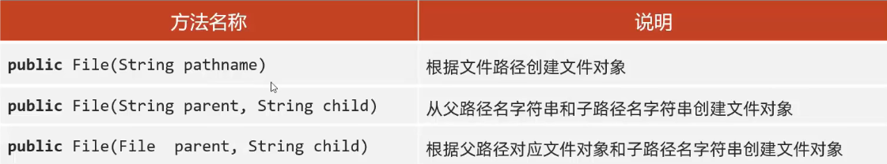

> **File类创建对象，支持相对路径和绝对路径**

- 绝对路径和相对路径
  - 绝对路径：从盘符开始

    ```File file1 = new File("D:\\Code\\a.txt")```
  - 相对路径：不带盘符，默认直接到当前工程下单目录寻找文件

    ```File file2 = new File("模块名\\a.txt")```

### FIle类常用API

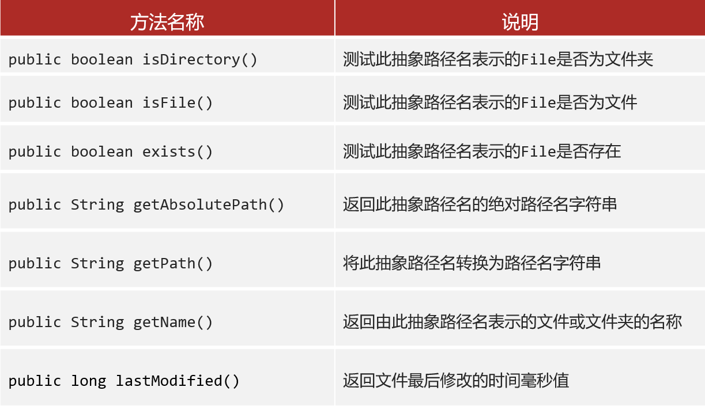

- File创建文件的功能
  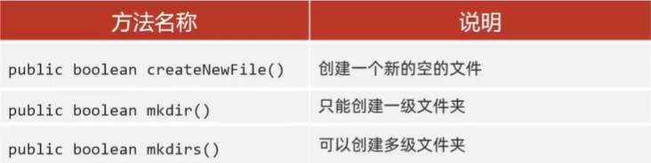
- File删除文件的功能
  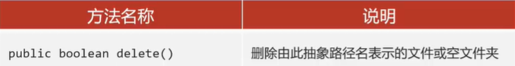
  - delete方法直接删除不走回收站；如果删除的是一个文件，且文件没有被占用则直接删除
  - delete方法默认只能删除空文件夹
- File类的遍历功能
  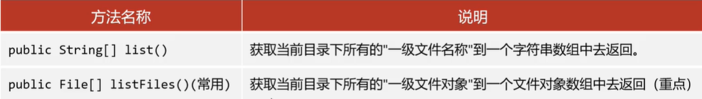
  - listFiles方法注意事项：
    - 当调用者不存在时，返回Null
    - 当调用者是一个文件职工，返回null
    - 当调用者是一个空文件夹是，返回一个长度为0的数组
    - 当调用者是一个有内容的文件夹时，将里面所有文件和文件夹的路径放在FIle数组中返回
    - 当调用者是一个有隐藏文件的文件夹时，将里面所有文件和文件夹的路径放在File数组中返回，包含隐藏内容

## 方法递归

- 方法直接调用自己或者简介调用自己的形式称为方法递归

### 递归的形式

- 直接递归:方法自己调用自己
- 间接递归:方法调用其他方法,其他方法又回调方法自己

> **递归如果没有控制好终止,会出现递归死循环,导致栈内存溢出**

### 递归算法的三要素

- 递归的公式
- 递归的终结点
- 递归的方向必须走向终结点

## 字符集

### ASCII字符集

- 每个信息交换标准代码:包括了数字、英文和符号
- 一个字节存储一个字符，一个字节是8位，总共可以表示128个字符信息，对应英文、数字来说是够用的

### GBK

- window系统默认的码表，兼容ASCII码表，也包含了几万个汉字，支持繁体汉字以及部分日韩文字
- 一个中文以两个字节的形式存储

### Unicode码表

- 计算机科学领域里的一项业界字符编码标准
- 容纳世界上大多数国家的常见文字和符号
- 先通过UTF-8，UTF-16，UTF-32的编码成二进制后在存储到计算机

> 注意：
>
> - UTF-8编码后一个中文一般以三个字节的形式存储
> - 兼容ASCII编码表
> - 编码前和编码后的字符集需要一致，否则会出现乱码

### String编码

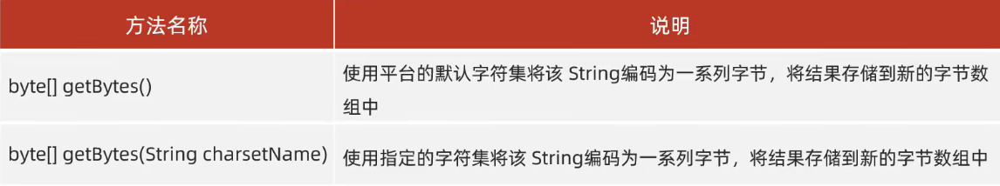

### String解码

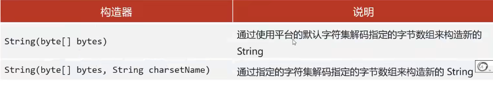

```java
String str = "hello,中国";
byte[] bytes = str.getBytes();    //平台默认字符集编码
System.out.println(new String(bytes));    //平台默认字符集解码

byte[] bytes = str.getBytes("GBK");     //指定字符集编码
System.out.println(new String(bytes,"GBK"));  //指定字符集解码
```

## IO流

也称输入、输出流，就是用来读写数据的

- I表示input，是数据从硬盘文件读写到内存的过程，称之输出，负责读
- O表示output，是内存程度的数据从内存到写到硬盘文件的过程称之输出，负责写

### IO流的分类

- 按流的方向分

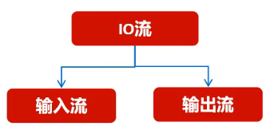

- 按流中数据最小的单位分

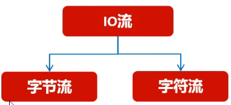

- 字节输入流：以内存为基准，来自磁盘的文件/网络中的数据**以字节的形式读到内存中**去的流
- 字节输出流：以内存为基准，来自内存中的数据以**字节的形式写到磁盘的文件/网络中**去的流
- 字节输入流：以内存为基准，来自磁盘的文件/网络中的数据**以字符的形式读到内存中**去的流
- 字节输入流：以内存为基准，来自内存中的数据**以字符的形式写到磁盘的文件/网络中**去的流

### IO流体系

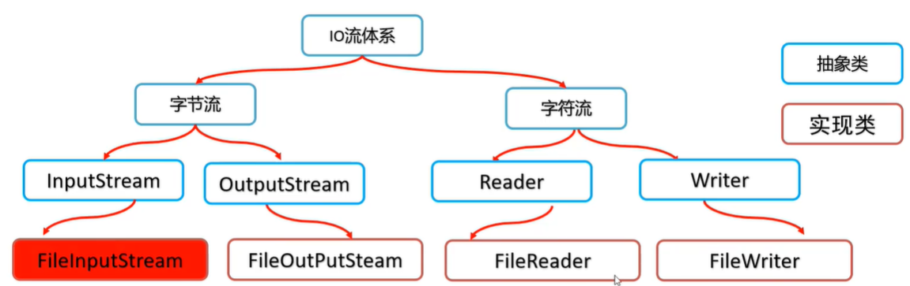

### 文件字节输入流：FileInputStream

- 以内存为基准，把磁盘中的数据以字节的形式读取到内存中去

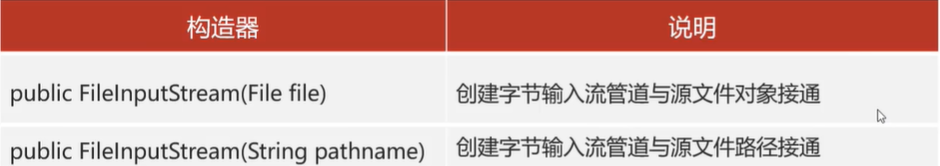


- 性能较慢
- 读取中文字符输出无法避免乱码问题

如何使用字节输入流读取中文内容输出不乱码？

- 一次性读完全部字节
- 可以定义与文件一样大的字节数组，也可以使用官方API

> **如果文件过大，定义的字节数组可能引起内存溢出**

### 文件字节输出流：FileOutputStream

- 以内存为基准，把内存中的数据以字节的形式写出到磁盘文件中去的流

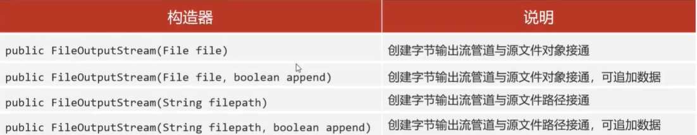