# JavaWeb

## 数据库

- 关系型数据库：建立在关系模型基础上的数据库，是由多张能相互连接的二维表组成的数据库

### MySQL

本机
账户:root
密码:root

#### 通用语法

1. SQL 语句可以导航或者多行书写，分号结尾
2. MySQL 数据库的 SQL 语句不区分大小写
3. 注释
   - 单行注释： -- 注释内容 或 #注释内容(MySQL 特有)
   - 多行注释：/\*注释\*/

### DDL

### 操作数据库

- 查询`show databases;`
- 创建
  - 创建数据库`create database 数据库名称;`
  - 判断，不存在则创建
    `create database if not exists 数据库名称;`
- 删除
  - 删除数据库`drop database 数据库名称;`
  - 判断删除
    `drop database if not exists 数据库名称;`
- 使用数据库
  - 查看当前使用的数据库`select database();`
  - 使用数据库
    `use 数据库名称`

### 操作表

- 查询表`show tables;`
- 查询表结构`desc 表名称;`
- 创建表
  `create table 表明( 字段名1 数据类型1, 字段名2 数据类型2, ... 字段名n 数据类型n );`

#### 数据类型

- 数值类型
- 日期和时间类型
- 字符串类型

## JDBC

使用 JAVA 语言操作关系型数据库

### 步骤

1. 创建工程,带入 jar 包
2. 注册驱动
3. 获取链接
4. 定义 SQL 语句
5. 获取执行 SQL 对象
6. 执行 SQL
7. 处理返回结果
8. 释放资源

```java
public static void main(String[] args) throws Exception {
        // 注册驱动
        Class.forName("com.mysql.jdbc.Driver");
        //获取链接
        String url="jdbc:mysql://localhost:3306/test";
        String username="root";
        String password="root";
        Connection connection = DriverManager.getConnection(url, username, password);
        //定义SQL语句
        String sql = "UPDATE test01 SET money = 10000 WHERE id=1;";
        //获取执行SQL对象
        Statement statement = connection.createStatement();
        //执行SQL
        int i = statement.executeUpdate(sql);
        //处理返回结果
        System.out.println(i);
        //释放资源
        statement.close();
        connection.close();
    }
```

### API 详解

#### DriveManager

1. 注册驱动
2. 获取数据库连接

#### Connection

1. 获取执行 SQL 的对象

   - 普通执行 SQL 对象`Statement createStatement()`
   - 预编译 SQL 的执行对象：防止 SQL 注入`PreparedStatement preparedStatement()`
   - 执行存储过程的对象
     `CallableStatement prepareCall(sql)`

2. 管理事务

   > MySQL 事务管理

   - 开启事务：BEGIN;/START TRANSACTION;
   - 提交事务：COMMIT;
   - 回滚事务：ROLLBACK;
     **MySQL 默认自动提交事务**

   > JDBC 事务管理

   - 开启事务：setAutoCommit(boolean autoCommit):true 为自动提交事务；false 为手动提交 事务，即为开启事务
   - 提交事务：commit()
   - 回滚事务：rollback()

#### Statemane

1.执行 SQL 语句

```java
int executeUpdate(sql)  //执行DML、DDL语句
// 返回值：1.DML语句影响的行数；2.DDL语句执行后，执行成功也可能返回0

RedultSet executeQuery(sql)     // 执行DQL语句
//返回值，ResultSet结果集对象
```

#### ResultSet

- 封装了 DQL 查询语句的结果

`ResultSet stmt.executeQuery(sql)`
:执行 DQL 语句，返回 ResultSet 对象

- 获取查询结果

`boolean next()`: 1. 将光标从当前位置向下移动一行(默认在第一行) 2.判断当前行是否为有效行返回值：

- true:有效行，当前行有数据
- false：无效行，当前行没有数据

`getxxx(参数)`:获取数据

- xxx:数据类型;如：int getint(参数)；String getString(参数)
- 参数：
  - int：列的编号，从 1 开始
  - String：列的名称

#### PreparedStatement

1. 预编译 SQL 并执行 SQL 语句

   1. 获取 PreparedStatement 对象

      ```java
      //SQL语句中的参数值，使用？占位符替代
      String sql = "select * from user where name = ? and password = ?";

      //通过Connection对象获取，并传入对应的SQL语句
      PreparedStatement preparedStatement = connection.preparedStatement(sql);
      ```

   2. 设置参数值

      - PreparedStatement 对象：`setXxx(参数1，参数2)`:给？赋值
        - Xxx：数据类型；如 setInt(参数 1，参数 2)
        - 参数：
          - 参数 1：？的位置编号，从 1 开始
          - 参数 2：？的位置

   3. 执行 SQL
      `executeUpdate();/executeQuery()`:不需要再传递 SQL

### 数据库连接池

- 一个负责分配，管理数据库连接的容器
- 允许应用程序重复使用一个现有的数据库连接，而不是再重新建立一个
- 释放空闲时间超过最大空闲时间多数据库连接来避免因为没有释放数据库连接而引起的数据库连接遗漏
- 好处
  - 资源重用
  - 提升系统响应速度
  - 避免数据集连接遗漏

#### 实现

- 标准接口：DataSource
  - 官方提供的数据库连接池标准接口，由第三方组织实现此接口
  - 功能：获取连接
    `Connection getConnection()`
- 常见的数据库连接池

  - DBCP
  - C3P0
  - Druid(德鲁伊)

    - 阿里巴巴开源的数据库连接池项目
    - 功能强大，性能优秀，是 JAVA 最好的数据库连接池之一
    - 使用步骤

      1. 导入 jarbao
      2. 定义配置文件
      3. 加载配置文件
      4. 获取数据库连接池对象
      5. 获取连接

      ```java
      //加载配置文件
        Properties properties = new Properties();
        properties.load(new FileInputStream("jdbc-Demo/src/druid.properties"));
        //获取连接池对象
        DataSource dataSource = DruidDataSourceFactory.createDataSource(properties);
        //获取数据库连接
        Connection connection = dataSource.getConnection();
        System.out.println(connection);
      ```

## Mybatis

定义数据库连接时可使用 `&amp;`分隔各项，如下：

`<property name="url" value="jdbc:mysql:///mybatis?useSSL=false&amp;useUnicode=true&amp;characterEncoding=UTF-8"/>`

useSSL、useUnicode 和 characterEncoding 分隔开来避免了报错

- 解决 SQL 映射文件的警告提示
  - 产生原因：idea 和数据库没有建立连接，不识别表的信息
  - 解决方式：在 idea 中配置 MySQL 数据库连接

### Mapper 代理开发

- 定义 SQL 映射文件同名的 Mapper 接口，并且将 Mapper 接口和 SQL 映射文件放置在同一目录下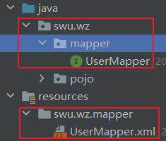
- 设置 SQL 映射文件的 namespace 属性为 Mapper 接口全限定名

```xml
<mapper namespace="swu.wz.mapper.UserMapper">
...
</mapper>
```

- 在 Mapper 接口中定义方法，方法名就是 SQL 映射文件中 SQL 语句的 id，并保持参数类型和返回值类型一致(**注意返回的是集合还是个体**)

```java
public interface UserMapper {
    List<User> selectAll();
}
```

```xml
<mapper namespace="swu.wz.mapper.UserMapper">
    <select id="selectAll" resultType="swu.wz.pojo.User">
        select * from tb_user;
    </select>
</mapper>
```

- 编码
  1. 通过 SQLSession 的 getMapper()方法获取 Mapper 接口的代理对象`UserMapper userMapper = sqlSession.getMapper(UserMapper.class);`
  2. 调用对应方法完成 SQL 的执行
     `List<User> users = userMapper.selectAll();`

> **如果 Mapper 接口名称和 SQL 映射文件名称相同，并在同一目录下，则可以使用包扫描的方式简化 SQL 映射文件的加载**

```xml
<mappers>
        <!--加载SQL映射文件-->
    <!--<mapper resource="swu/wz/mapper/UserMapper.xml"/>-->
        <!--Mapper代理方式-->
        <package name="swu.wz.mapper"/>
</mappers>
```

### 核心配置文件

MyBatis 核心配置文件的顶层结构如下：

- configuration(配置)
  - properties(属性)
  - setting(设置)
  - typeAliases(类型别名)
  - typeHandlers(类型处理器)
  - objectFactory(对象工厂)
  - plugins(插件)
  - environments(配置数据库连接环境信息，可以配置多个 environment，通过 default 属性切换不同的 environment)
    - enviroment(环境变量)
      - transaction(事务管理器)
      - dataSource(数据源)
    - databaseProvider(数据库厂商标识)
    - mappers(映射器)

> **配置各个标签时，需要遵守前后顺序**

### CURD

> 数据库表的字段名称和实体类的属性名称不一样，则不能自动封装数据

解决方式：

1. 别名：对不一样的列名起别名，让别名和实体类的属性名一样(缺点：每次查询你都要定义一次别名)

   ```xml
   <select id="selectAll" resultType="swu.wz.pojo.Brand">
        select id, brand_name as brandName, company_name as companyName, ordered, description, status
        from tb_brand;
    </select>
   ```

   - 缺点：每次查询都要定义一次别名

     - SQL 片段

       ```xml
       <sql id="brand_column">-->
         id, brand_name as brandName, company_name as companyName, ordered, description, status
       </sql>
       <select id="selectAll" resultType="brand">
         select <include refid="brand_column"></include> from tb_brand;
       </select>
       ```

       - 缺点：不灵活

2. ResultMap

- 定义\<resultMap>标签
- 在\<select>标签中，使用 resultMap 属性替换 resultType 属性

```xml
<resultMap id="brandResultMap" type="brand">    //id：唯一标识  type:映射的类型，支持别名
        <result column="brand_name" property="brandName"/>
        <result column="company_name" property="companyName"/>
        <!--
          id:主键字段的映射
            column:表的列名
            property:一般字段的映射
          result：一般字段的映射
         -->
    </resultMap>
    <select id="selectAll" resultMap="brandResultMap">
        select *
        from tb_brand;
    </select>
```

- 参数占位符

  1. #{}：会替换成？，防止 SQL 注入，适用于参数传递的时候

     ```SQL
     select * from tb_brand where id = #{}
     等价于
     select * from tb_brand where id = ?
     ```

  2. ${}：自动替换为相应的值，存在 SQL 注入问题，在表名或者列名不固定的时候可以使用

     ```SQL
     select * from tb_brand where id = ${}
     等价于
     select * from tb_brand where id = 1
     ```

- 特殊字符处理

  - 转义字符
  - CDATA 区

> SQL 语句设置多个参数有几种方式(条件查询)

1. 散装参数
   - 需要使用@Param(SQL 中的参数占位符名称) ```
2. 实体类封装参数
   - 只需要包装 SQL 中的参数名和实体类属性名对应上，即可设置成功`
3. map 集合
   - 只需要包装 SQL 中的参数名和 map 集合的键对应上，即可设置成功

```xml
   List<Brand> selectByCondition(@Param("status") int status, @Param("companyName") String companyName, @Param("brandName") String brandName);
   List<Brand> brands = brandMapper.selectByCondition(brand);
   List<Brand> brands = brandMapper.selectByCondition(map);
```

```java
//散装参数
List<Brand> brands = brandMapper.selectByCondition(status, companyName, brandName);

//实体类封装参数
Brand brand = new Brand();
brand.setStatus(status);
brand.setCompanyName(companyName);
brand.setBrandName(brandName);
List<Brand> brands = brandMapper.selectByCondition(brand);

//Map
Map map = new HashMap();
map.put("status",status);
map.put("companyName",companyName);
map.put("brandName",brandName);
List<Brand> brands = brandMapper.selectByCondition(map);
```

- 动态条件查询

if:用于判断参数是否有值，使用 Test 属性进行条件判断

- 存在的问题：第一个条件不需要逻辑运算符
- 解决方案：

  - 使用恒等式让所有条件都一样

    ```sql
    select *
        from tb_brand
        where 1=1
        <if test="status != null">
            and status=#{status}                  /*等值连接*/
        </if>
        <if test="companyName != null and companyName!='' ">
            and company_name like #{companyName}    /*模糊查询*/
        </if>
        <if test="brandName!=null and brandName!='' ">
            and brand_name like #{brandName}
        </if>
    ```

  - where 标签替换 where 关键字

    ```xml
    <select id="selectByCondition" resultMap="brandResultMap">
        select *
        from tb_brand
        <where>
            <if test="status != null">
                and status=#{status} /*等值连接*/
            </if>
            <if test="companyName != null and companyName!='' ">
                and company_name like #{companyName} /*模糊查询*/
            </if>
            <if test="brandName!=null and brandName!='' ">
                and brand_name like #{brandName}
            </if>
        </where>
    </select>
    ```

#### 添加

先在 XML 文件中插入 SQL 语句

```xml
<insert id="add">
        insert into tb_brand (brand_name, company_name, ordered, description, status)
        values (#{brandName},#{companyName},#{ordered},#{description},#{status});
</insert>
```

并在接口文件中声明函数

```java
void add(Brand brand);
```

封装要添加的对象后使用 Mapper 接口的代理对象调用函数，注意提交事务，否则无法添加

```java
 SqlSession sqlSession = sqlSessionFactory.openSession(true);   //开启事务的自动提交
brandMapper.add(brand);
 /*提交事务*/
sqlSession.commit();
```

> MyBatis 事务：
>
> - openSession():默认开启事务，进行增删改查操作后需要使用 sqlSession.commit()手动提交事务
> - openSession(true)：可以设置自动提交事务

- **主键返回**

在数据添加成功后，需要获取插入数据库数据的主键的值，比如：订单和订单号

只需要在 xml 文件的\<insert>标签中添加两个属性：useGeneratedKeys(开启主键返回，默认是关闭的) keyProperty(指向要返回的值)

```xml
<insert id="add" useGeneratedKeys="true" keyProperty="id">
        insert into tb_brand (brand_name, company_name, ordered, description, status)
        values (#{brandName},#{companyName},#{ordered},#{description},#{status});
</insert>
```

#### 修改

- 修改全部字段

先在 XML 文件中插入 SQL 语句

```xml
<update id="update">
        update tb_brand
        set
            brand_name = #{brandName},
            company_name = #{companyName},
            ordered = #{ordered},
            description = #{description},
            status = #{status}
        where id = #{id};
</update>
```

并在接口文件中声明函数

```java
int update(Brand brand);
```

封装要修改的对象后使用 Mapper 接口的代理对象调用函数即可

```java
brandMapper.update(brand);
```

- 修改动态字段

在 xml 文件中利用\<set>标签和\<if>标签定义 SQL 语句如下，其他不变

```xml
<update id="update">
        update tb_brand
        <set>
            <if test="brandName!=null and brandName!=''">
                brand_name = #{brandName},
            </if>
            <if test="companyName!=null and companyName!=''">
                company_name = #{companyName},
            </if>
            <if test="ordered!=null">
                ordered = #{ordered},
            </if>
            <if test="description!=null and description!=''">
                description = #{description},
            </if>
            <if test="status!=null and status!=''">
                status = #{status}
            </if>
        </set>
        where id = #{id};
</update>
```

#### 删除

- 删除一个

接口中声明删除方法

```java
void deleteById(int id);
```

在 xml 文件中插入 SQL 语句

```xml
<delete id="deleteById"> delete from tb_brand where id=#{id}; </delete>
```

最后使用 Mapper 接口的代理对象调用函数即可

```java
brandMapper.deleteById(id);
```

- 批量删除

接口中声明删除方法，此时传入的参数是一个删除对象的主键的数组

```java
void deleteByIds(int[] ids);
```

在 xml 文件中插入 SQL 语句,使用 foreach 遍历数组，collection 的参数可以通过@Param 自定义，item 选择对应的属性，separator 选择分隔符，其他不变

```xml
<delete id="deleteByIds">
        delete from tb_brand where id in (
            <foreach collection="array" item="id" separator=",">
                #{id}
            </foreach>
        );
</delete>
```

### 参数传递

MyBatis 接口方法中可以接受各种各样的参数，MyBatis 底层对于这些参数进行不同的封装处理

- 单个参数

  - POJO 类型：直接使用，但要属性名和参数占位符的名称一致
  - Map 集合：直接使用，但要键名和参数占位符的名称一致
  - COllection:封装为 Map 集合，可以使用@Param 注解，替换 Map 集合中默认的 arg 键名

    ```java
    map.put("arg0",COllection集合)
    map.put("COllection",COllection集合)
    ```

  - List：封装为 Map 集合，可以使用@Param 注解，替换 Map 集合中默认的 arg 键名

  ```java
    map.put("arg0",List集合)
    map.put("param1",List集合)
    map.put("list",List集合)
  ```

  - Array:封装为 Map 集合，可以使用@Param 注解，替换 Map 集合中默认的 arg 键名

  ```java
  map.put("arg0",数组)
  map.put("array",数组)
  ```

  - 其他类型：直接使用

- 多个参数

  使用@Param 注解定义参数的名称，这个名称要与 SQL 语句中的参数占位符一致

  `User select(@Param("username") Sring username,(@Param("password") Sring password);`

  ```xml
  <select id="select" resultType="user">
    select * from tb_user where
      username=#{username} and password=#{password};
  </select>
  ```

> **MyBatis 提供了 ParamNameResolver 类来进行参数封装**

传入多个参数时，自动封装为 Map 集合，默认的键名有 arg(从 0 开始，arg0,arg1...)和 param(从 1 开始,param1,param2...),未使用注解的时候，可以在 SQL 语句的参数占位符直接使用 arg 和 param,也可以使用@Param 注解，替换 Map 集合中默认的 arg 键名

```java
map.put("arg0",参数值1)
map.put("param1",参数值1)
map.put("param2",参数值2)
map.put("arg1",参数值2)
/*@Param("username")*/
map.put("username",参数值1)
map.put("param1",参数值1)
map.put("param2",参数值2)
map.put("arg1",参数值2)
```

> 建议：将来使用@Param 注解来修改 Map 集合中默认的键名，并使用修改后的名称来获取值，这样可读性更高

### 注解完成增删改查

- 查询：@Select

  ```java
   /*查询所有*/
    @Select("select id, brand_name as brandName, company_name as companyName, ordered, description, status from tb_brand;")
    List<Brand> selectAll();
  ```

- 添加：@Insert

  ```java
  @Update("insert into tb_brand (brand_name, company_name, ordered, description, status) values (#{brandName}, #{companyName}, #{ordered}, #{description}, #{status})")
  void add(Brand brand);
  ```

- 修改：@Update

  ```java
  @Update("update tb_brand set brand_name = #{brandName},company_name = #{companyName},ordered = #{ordered},description = #{description},status = #{status}  where id = #{id};")
  int update( @Param("id")int id,@Param("brandName") String brandName,@Param("companyName")String companyName,@Param("ordered")int ordered,@Param("description")String description,@Param("status")int status);
  ```

- 删除：@Delete

  ```java
  //通过id删除一个对象
      @Delete("delete from tb_brand where id=#{id};")
      void deleteById(int id)
  ```

> 注解完成简单功能，配置文件完成复杂功能

## HTML

- HTML(Hyper Text Markup Language):超文本标记语言
  - 超文本：超越了文本的限制，比普通文本更强大，除了文字信息，还可以定义图片，音频，视频等内容
  - 标记语言：由标签构成的语言
- HTML 运行在浏览器上，HTML 标签由浏览器来解析
- W3C 标准：网页主要由三部分组成
  - 结构：HTML
  - 表现：CSS
  - 行为：JavaScript

### 基础标签

|    标签     |                描述                |
| :---------: | :--------------------------------: |
| \<h1>~\<h6> |         定义标题，h1 最大          |
|   \<font>   | 定义文本的字体、字体尺寸，字体颜色 |
|    \<b>     |            定义粗体文本            |
|    \<i>     |            定义斜体文本            |
|    \<u>     |           定义文本下划线           |
|  \<center>  |            定义文本居中            |
|    \<p>     |              定义段落              |
|    \<br>    |              定义折行              |
|    \<hr>    |             定义水平线             |

### 图片、音频、视频

- img:定义图片
  - src:规定显示图像的 URL(同一资源定位符)
    - 资源路径
      - 相对路径
      - 绝对路径
    - 尺寸单位
      - px:像素
      - 百分比
  - height：定义图像高度
  - width：定义图像宽度
- audio：定义音频,支持格式：MP3、WAV、OGG
  - src:规定音频的 URL
  - controls：显示播放控件
- video：定义视频，支持格式：MP ￥、WebM、OGG
  - src:规定视频的 URL
  - controls:显示播放控件

### 超链接标签

\<a>:定义超链接，用于连接到另一个资源

- href：指定访问资源都 URL
- target：指定打开资源的方式
  - \_self：默认值，在当前页面打开
  - \_blank:在空白页面打开

### 列表标签

| 标签  |     描述     |
| :---: | :----------: |
| \<ol> | 定义有序列表 |
| \<ul> | 定义无序列表 |
| \<li> |  定义列表项  |

- type：设置项目符号

### 表格标签

- table：定义表格
  - border：规定表格边框的宽度
  - width：规定表格的宽度
  - cellspacing：规定单元格之间的空白
- th:定义表头单元格
- tr:定义行
  - align:定义表格行的内容对齐方式
- td:定义单元格
  - rowspan:规定单元格可横跨的行数
  - clospan:规定单元格可横跨的列数

### 布局标签

- \<div>:定义 HTML 文档中一个区域部分，经常与 CSS 一起使用，用来布局网页
- \<span>:用于组合行内元素

### 表单标签

- 表单：在网页中主要负责数据采集功能，使用\<form>标签定义表达
- 表单项：不同类型的 input 元素，下拉列表，文本域等

|    标签     |                   描述                   |
| :---------: | :--------------------------------------: |
|   \<form>   |                 定义表单                 |
|  \<input>   | 定义表单项，通过 type 属性控制输入的形式 |
|  \<label>   |             为表单项定义标注             |
|  \<select>  |               定义下拉列表               |
|  \<option>  |           定义下拉列表的列表项           |
| \<textarea> |                定义文本域                |

- form：定义表单
  - action：规定的提交表单时向何处发送表单数据，URL
  - method：规定用于发送表单数据的方式
    - get：默认值，浏览器会将数据直接负载表单的 action URL 之后，大小有限制，4kb
    - post：浏览器会将数据放到 http 请求消息体中，大小无限制

### 表单项标签

- \<input>:表单项，通过 type 属性控制输入形式
  - type 取值：
    - text：默认值，定义单行输入字段
    - password：密码自渡那
    - radio：单选按钮
    - checkbox：复选框
    - file：文件上传按钮
    - hidden：隐藏输入字段
    - submit：提交按钮，会把表单数据发送到服务器
    - reset：重置按钮，清除表单中所有数据
    - button：可点击按钮

### CSS

CSS(Cascading Style Sheet):层叠样式表

#### 导入方式

- 内联样式：在标签内部使用 style 属性，属性值是 CSS 属性键值对

  `<div style="color:red">Hello CSS</div>`

- 内部样式：定义\<style>标签，在标签内部定义 CSS 样式

  ```html
  <style type="text/css">
    div {
      color: red;
    }
  </style>
  ```

- 外部样式:定义 Link 标签，引入外部的 CSS 文件

  文件 demo.css

  ```html
  div{ color:red; }
  ```

  ```html
  <link rel="sytlesheet" href="demo.css" />
  ```

#### CSS 选择器

选择器是选取需设置样式的元素(标签)

- 元素选择器

  `元素名称{color:red}`

  `div{color:red}`

- id 选择器

  `#id属性值{color:red}`

  ```html
  #name{color:red}
  <div id="name">hello css2</div>
  ```

- 类选择器

  `.class属性值{color:red}`

  ```html
  .cls{color:red}
  <div class="cls">hello css3</div>
  ```

## JavaScript

一门跨平台，面向对象的脚本语言，来控制网页行为，它能使网页交互

### JavaScript 引入方式

- 内部脚本：将 JS 代码定义在 HTML 页面中，JavaScript 代码必须位于\<script>与<\script>标签之间

  ```js
  <script>alert("hello JS");</script>
  ```

  > 在 HTML 文档中可以在任意地方，防止任意数量的\<script>
  > 一般把脚本置于\<body>元素的底部，可改善显示速度，因为脚本执行会拖慢显示

- 外部脚本：将 JS 代码定义在外部 JS 文件中，然后引入到 HTML 页面中

  - 外部文件：demo.js`alert("hello js");`
  - 引入外部 js 文件
    `<script src="../js/demo.js"></script>`

> **注意：外部脚本不能包含\<script>标签** > **\<script>标签不能自闭合**

### JavaScript 基础语法

#### 输出语句

- window.alert()写入警告框.例：`window.alert("hello js")`
- document.write()写入 HTML 输出.例：`document.write("hello js")`
- console.log()写入警告框.例：`console.log("hello js")`

### 变量

- JavaScript 中用 `var`关键字来声明变量
- JavaScript 是一门若类型语言，变量可以存放不同类型的值

  ```js
  var test = 1;
  test = "test";
  ```

- 变量名要遵循如下规则：

  - 组成字符科颜氏任何字母、数字、下划线或者美元符号
  - 数字不能开头
  - 建议使用驼峰命名

- ECMAScript6 新增了 `let`关键字来定义变量，用法类似 `var`，但是所声明的变量只在关键字所在的代码块内有效，且不允许重复声明
- ECMAScript6 新增了 `const`关键字，用来声明一个只读的常量，一旦声明，常量的值就不能改变

#### JavaScript 数据类型

js 中分为原始类型和引用类型

- 5 种原始类型
  - number:数字(整数，小数，NaN)
  - string：字符、字符串，单双引号都可以
  - boolean：布尔，true，false
  - null:对象为空
  - undefined：当声明的变量未初始化时，该变量的默认值是 undefined

#### 运算符

大部分运算符和 JAVA 中一样，除了以下两个：

- ==
  - 首先判断类型是否一样，如果不一样，则进行类型转换
  - 再去比较值
- ===
  - 首先判断类型是否一样，如果不一样，直接返回 false
  - 再去比较值

### 类型转换

- 其他类型--->number
  - string：按照字符的字面值转为数字，如果字面值不是数字，则转为 NaN(Not a Number)
  - boolean：true 转为 1，false 转为 0
- 其他类型--->boolean
  - number：0 和 NaN 转为 false，其他数字转为 true
  - string：空字符串转为 false，其他字符串转为 true
  - Null：false
  - undefined：false

### 流程控制语句

- if
- switch
- for
- while
- do...while

> 使用上和 JAVA 几乎没有区别

### 函数

函数(方法)是被设计为执行特定任务的代码块，JavaScript 函数通过 `function`关键字进行定义，语法为

```js
function functionName(参数1, 参数2) {
  //要执行的代码
}

function add(a, b) {
  return a + b;
}
```

调用：函数名称(实际参数列表)

`let result = add(1,2)`

注意：

- **形式参数不需要类型，因为 JavaScript 是若类型语言**
- **返回值也不需要定义类型，可以在函数内部直接使用 return 返回即可**

定义方式二：

```js
var functionName = function (参数列表) {
  //执行的代码
};

var add = function (a, b) {
  return a + b;
};
```

调用：js 中，函数调用可以传递任意个数参数,但只有定义的个数有用，其他没有作用

```js
let result = add(1, 2, 3); //相当于add(1,2)
```

### Array 对象

- 定义

```js
var 变量名 = new Array(元素列表); //方式一
var arr = new Array(1, 2, 3);

var 变量名 = [元素列表]; //方式二
var arr = [1, 2, 3];
```

- 访问

```js
arr[索引] = 值;
arr[0] = 1;
```

> **注意：JS 数组类似于 JAVA 集合，长度，类型都可变**

### String 对象

- 定义

```js
var 变量名 = new String(s); // 方式一
var str = new String("hello");

var 变量名 = s; //方式二
var str = "hello";
var str = "hello";
```

- 属性
  - length：字符串的长度
- 方法
  - charAt：返回指定位置的字符
  - indexOf(): 检索字符串

## Web 核心

### HTTP

- 概念：HyperText Transfer Protocol，超文本传输协议，规定了浏览器和服务器之间数据传输的规则
- 特点

  1. 基于 TCP 协议：面向连接，安全
  2. 基于请求-相应模型：一次请求对应一次响应
  3. 无状态的协议：对于事物处理没有记忆能力。每次请求-响应都是独立的

  - 缺点：多次请求间不能共享数据
  - 优点：速度快

#### HTTP 请求数据格式

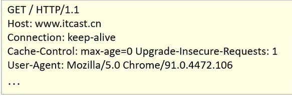

1. 请求行：请求数据的第一行。GET 表示请求方式，/表示请求资源路径，HTTP/1.1
2. 请求头：第二行开始，格式为 key:value 形式
3. 请求体：POST 请求的最后一部分，存放请求参数

- 常见的 HTTP 请求头：
  - Host:请求主机名
  - User-Agent:浏览器版本
  - Accept：表示可以接收的资源类型
  - Accept-Language:表示浏览器偏好语言，服务器可以据此返回不同语言的网页
  - Accept-Encoding:表示浏览器可以支持的压缩类型

> GET 请求和 POST 请求的区别

1. GET 请求请求参数再请求行中，没有请求体。PST 请求请求参数再请求体中
2. GET 请求请求参数有大小限制，POST 没有

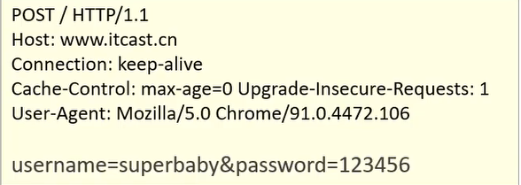

#### HTTP 响应数据格式

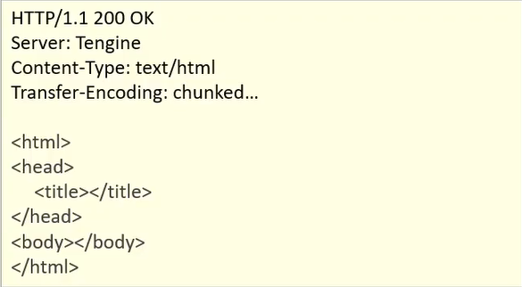

1. 响应行：响应数据的第一行。其中 HTTP/1.1 表示协议版本，200 表示响应状态码，OK 表示状态码表述
2. 响应头：第二行开始，格式为 key:value 形式
3. 响应体：最后一部分。存放响应数据

### 响应状态码

| 状态码分类 | 说明                                                                                                     |
| ---------- | -------------------------------------------------------------------------------------------------------- |
| 1xx        | **响应中**——临时状态码，表示请求已经接受，告诉客户端应该继续请求或者如果它已经完成则忽略它               |
| 2xx        | **成功**——表示请求已经被成功接收，处理已完成                                                             |
| 3xx        | **重定向**——重定向到其它地方：它让客户端再发起一个请求以完成整个处理。                                   |
| 4xx        | **客户端错误**——处理发生错误，责任在客户端，如：客户端的请求一个不存在的资源，客户端未被授权，禁止访问等 |
| 5xx        | **服务器端错误**——处理发生错误，责任在服务端，如：服务端抛出异常，路由出错，HTTP 版本不支持等            |

常见的响应码

| 状态码 | 英文描述                              | 解释                                                                                                 |
| ------ | ------------------------------------- | ---------------------------------------------------------------------------------------------------- |
| 200    | **`OK`**                              | 客户端请求成功，即**处理成功**，这是我们最想看到的状态码                                             |
| 302    | **`Found`**                           | 指示所请求的资源已移动到由`Location`响应头给定的 URL，浏览器会自动重新访问到这个页面                 |
| 304    | **`Not Modified`**                    | 告诉客户端，你请求的资源至上次取得后，服务端并未更改，你直接用你本地缓存吧。隐式重定向               |
| 400    | **`Bad Request`**                     | 客户端请求有**语法错误**，不能被服务器所理解                                                         |
| 403    | **`Forbidden`**                       | 服务器收到请求，但是**拒绝提供服务**，比如：没有权限访问相关资源                                     |
| 404    | **`Not Found`**                       | **请求资源不存在**，一般是 URL 输入有误，或者网站资源被删除了                                        |
| 428    | **`Precondition Required`**           | **服务器要求有条件的请求**，告诉客户端要想访问该资源，必须携带特定的请求头                           |
| 429    | **`Too Many Requests`**               | **太多请求**，可以限制客户端请求某个资源的数量，配合 Retry-After(多长时间后可以请求)响应头一起使用   |
| 431    | **`Request Header Fields Too Large`** | **请求头太大**，服务器不愿意处理请求，因为它的头部字段太大。请求可以在减少请求头域的大小后重新提交。 |
| 405    | **`Method Not Allowed`**              | 请求方式有误，比如应该用 GET 请求方式的资源，用了 POST                                               |
| 500    | **`Internal Server Error`**           | **服务器发生不可预期的错误**。服务器出异常了，赶紧看日志去吧                                         |
| 503    | **`Service Unavailable`**             | **服务器尚未准备好处理请求**，服务器刚刚启动，还未初始化好                                           |
| 511    | **`Network Authentication Required`** | **客户端需要进行身份验证才能获得网络访问权限**                                                       |

### TomCat

一个轻量级 Web 服务器，支持 Servlet/JSP 少量 JavaEE 规范，封装 HTTP 协议操作，简化开发，可以把 web 项目部署到服务器中，对外提供网上浏览服务

### Servlet

一门动态 web 资源开发技术

#### 快速使用

1. 创建 web 项目，导入 Servlet 依赖坐标

   ```xml
     <dependencies>
         <dependency>
           <groupId>javax.servlet</groupId>
           <artifactId>javax.servlet-api</artifactId>
           <version>3.1.0</version>
           <scope>provided</scope>
         </dependency>
     </dependencies>
   ```

2. 创建：定义一个类，实现 Servlet 接口，重写接口中所有方法

   ```Java
   public class ServletDemo01 implements Servlet {
     public void init(ServletConfig servletConfig) throws ServletException {
         System.out.println("using servlet success");
     }
   }
   ```

3. 配置：再在刚刚创建的类上使用@WebServlet 注解，配置该 Servlet 的访问路径

   ```java
   @WebServlet("/demo1")
   ```

4. 访问：启动 Tomcat,浏览器输入 URL 访问该 Servlet

#### Servlet 执行流程

- Servlet 由 web 服务器创建，Servlet 方法由 Web 服务器调用
- 自定义的 Servlet 必须实现 Servlet 接口并复写其方法，使用 Servlet 接口中由 Servlet 方法

#### Servlet 生命周期

对象的生命周期指一个对象从被创建到被销毁的整个过程

Servlet 运行在 web 服务器中，其生命周期由容器来管理，分为 4 个阶段

1. 加载和实例化：默认情况下，当 Servlet 第一次被访问时，由容器创建 Servlet
2. 初始化：在 Servlet 实例化之后，容器将调用 Servlet 的`init()`方法初始化这个对象，完成一些如加载配置文件，创建连接等初始化工作。该方法只**调用一次**
3. 请求处理：**每次**请求 Servlet 时，Servlet 容器都会调用 Servlet 的`service()`方法对请求进行处理
4. 服务终止：当需要释放内存或者容器关闭时，容器就会调用 Servlet 实例的`destory()`方法完成资源的释放。在`destory()`方法调用之后，容器会释放这个 Servlet 实例，该实例随后会被 Java 的垃圾收集器回收

#### Servlet 方法介绍

- `public String getServletInfo()`

获取信息，一般返回`null`或者空字符串

- `public ServletConfif getServletConfig()`

获取 Servlet 配置对象，web 服务器在调用`init()`方法时，会传入一个`ServletConfig`类型的局部对象,将其赋值为`ServletConfig`类型的成员变量返回即可

### Servlet 体系结构

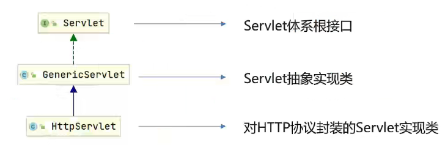

HttpServlet 的请求原理

获取请求方式，由于 get 请求和 Post 请求的请求消息不一样，要分别处理，根据不同的请求方法，调用不同的方法

---

HttpServlet 使用步骤

1. 继承`HttpServlet`
2. 重写`doGet`和`doPost`方法

#### Servlet urlPattern 配置

> **Servlet 要想被访问，必须配置其访问路径(urlPattern)**

1. 一个 Servlet，可以配置多个 urlPattern

   ```java
   @WebServlet(urlPatterns={"/demo1","/demo2"})
   ```

2. urlPattern 配置规则
   1. 精确匹配：配置中的路径和浏览器中的路径要完全一样
      - 配置路径：`@WebServlet(urlPatterns="/user/select")`
      - 访问路径: `localhost:8080/webdemo/user/select`
   2. 目录匹配
      - 配置路径：`@WebServlet(urlPatterns="/user/*")`
      - 访问路径: `localhost:8080/webdemo/user/aaa`  
         `localhost:8080/webdemo/user/bbb`
   3. 扩展名匹配
      - 配置路径：`@WebServlet(urlPatterns="*.do")`
      - 访问路径: `localhost:8080/webdemo/user/aaa.do`  
         `localhost:8080/webdemo/user/bbb.do`
   4. 任意匹配
      - 配置路径：`@WebServlet(urlPatterns="/*")`
        `@WebServlet(urlPatterns="/")`
      - 访问路径: `localhost:8080/webdemo/user/aaa`  
         `localhost:8080/webdemo/user/bbb`
      - `/`和`/*`的区别：配置了`/`，会覆盖掉 tomcat 中的 DefaultServlet(用于处理静态资源的访问，其他 urlPattern 匹配不上时走这个 Servlet)，访问不了静态资源；配置了`/*`,以为访问任意访问路径

#### XML 配置方式编写 Servlet

Servlet 从 3.0 版本后开始支持使用注解配置，之前只支持 XML 配置文件的配置方式

- 步骤：

  1. 编写 Servlet 类
  2. 在 web.xml 中配置该 Servlet

  ```xml
      <!-- 配置Servlet 全类名 -->
  <servlet>
      <servlet-name>demo13</servlet-name>
      <servlet-class>com.itheima.web.ServletDemo13</servlet-class>
  </servlet>
      <!-- 配置Servlet 访问路径 -->
  <servlet-mapping>
      <servlet-name>demo13</servlet-name>
      <url-pattern>/demo13</url-pattern>
  </servlet-mapping>
  ```

### Request

#### Request 继承体系

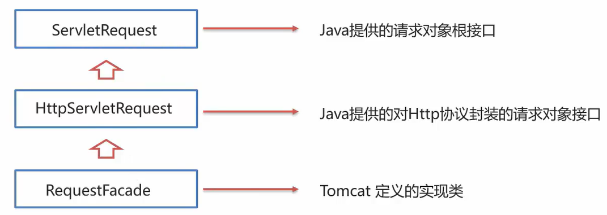

> Tomcat 需要解析请求数据，封装为 request 对象并且创建 request 对象传递到 service 方法中

#### Request 获取请求数据

- 请求数据分为三部分：

  1. 请求行：`GET /request-demo/req1?username=zhangsan HTTP/1.1`
     - String getMethod():获取请求方式：GET
     - String getContextPath():获取虚拟目录(项目访问路径)：/request-demo
     - StringBuffer getRequestURL():获取 URL：`http://localhost:8080/request-demo/req1`
     - String getRequestURI():获取 URI：/request-demo/req1
     - String getQueryString():获取请求参数(GET 方式)：username=zhangsan&password=123
  2. 请求头：`User-Agent:Mozilla/5.0 Chrome/9.10.4482.106`
     - String getHeader(String name):根据请求头名称， 获取值
  3. 请求体：`username=sperbaby&password=123`
     - ServletInputStream getInputStream():获取字节输入流
     - BufferedReader getReader():获取字符输入流(使用于纯文本信息)

- **Request 通用方式获取请求参数**

  - `Map<String,String> getParameterMap()`:获取所有参数 Map 集合
  - `String[] getParameterValues(String name)`：根据名称获取参数值(数组)
  - `String getParameter(String name)`:根据名称获取参数值(单个值)

- 处理参数中文乱码,请求参数中存在中文数据，则会乱码
  - POST：设置输入流的编码
    `req.seCharacterENcoding("UTF-8");`
  - 通用方式(GET/POST):先编码，再解码
    `new String(username.getBytes("ISO-8859"),"UTF-8");`
  - URL 编码
    1. 将字符串按照编码方式转为二进制
    2. 每个字节转为 2 个 16 进制数并在前边加上%

#### Request 请求转发

- 请求转发：一种在服务器内部的资源跳转方式

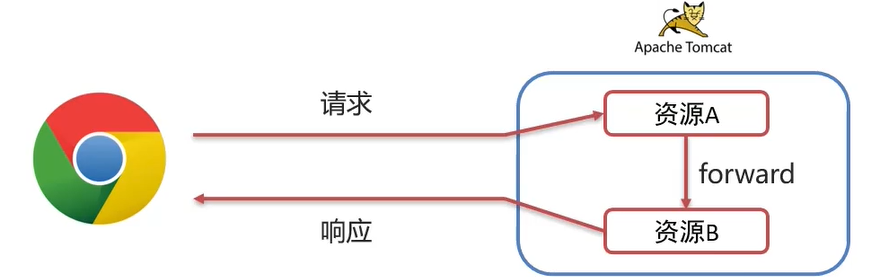

- 实现方式：`req.getRequestDispatcher("资源B路径").forward(req,resp);`
- 请求转发资源减共享数据：使用 Request 对象
  - void setAttribute(String name,Object o):存储数据到 request 域中
  - Object getAttribute(String name)：根据 key,获取值
  - void removeAttribute(String name):根据 key,删除该键值对
- 特点
  - 浏览器地址栏路径不发生变化
  - 只能转发到当前服务器的内部资源
  - 一次请求，可以在转发的资源减使用 request 共享数据

### Response

- 体系结构
  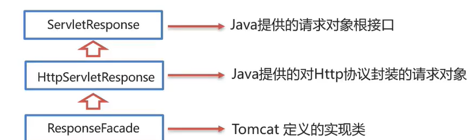

#### 设置响应数据

- 响应数据分为 3 部分：
  1. 响应行：`HTTP/1.1 200 OK`
     - `void setStatus(int sc)`:设置响应状态码
  2. 响应头：`Content-Type:text/html`
     - `void setHeader(String name,String value)`:设置响应头键值对
  3. 响应体: `<html><head>head><body></body></html>`
     - PrintWriter getWriter():获取字符输出流
     - ServletOutPutStream getOutputStream():获取字节输出流

#### Response 完成重定向

- 重定向：一种资源跳转方式

  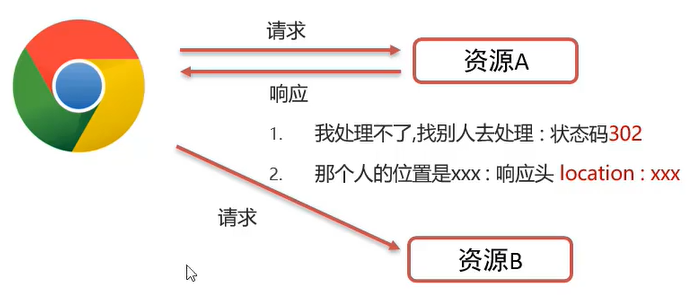

- 实现方式

  ```java
  resp.setStatus(302);
  resp.setHeader("location","资源B的路径");
  ```

简化实现为

```java
resp.sendRedirect("资源B的路径");
```

- 重定向特点
  - 卢兰其地址栏路径发生变化
  - 可以重定向任意位置的资源(服务器内部，外部均可)
  - 两次请求，不能再多个资源使用 request 共享数据

#### Response 响应字符数据

- 使用
  - 通过 Response 对象获取字符输出流：`PrintWriter writer=resp.getWriter();`
  - 写数据：`writer.write("qqq");`
- 注意
  1. 该流不需要关闭，随着响应结束，response 对象销毁，由服务器关闭
  2. 中文数据乱码：原因通过 Response 获取的字符输出流默认编码：ISO-8859-1
     `resp.setContentType("text/html;charset=utf-8");`

## JSP

Java Server Pages，Java 服务端页面，一种动态的网页技术，既可以定义 HTML，JS,CSS 等静态内容，还可以定义 Java 代码的动态内容，简化开发，避免了再 Servlet 中直接输出 HTML 标签

### JSP 快速入门

1. 导入 JSP 坐标

   ```xml
   <dependency>
      <groupId>javax.servlet.jsp</groupId>
      <artifactId>jsp-api</artifactId>
      <version>2.2</version>
      <scope>provided</scope>
    </dependency>
   ```

2. 创建 JSP 文件
3. 编写 HTML 和 Java 代码

### JSP 原理

JSP 本质上就是一个 Servlet，JSP 在被访问时，由 JSP 容器(tomcat)将其转换为 Java 文件(Servlet)，再由 JSP 容器(Tomcat)将其编译，最终对外提供服务的其实就是这个字节码文件

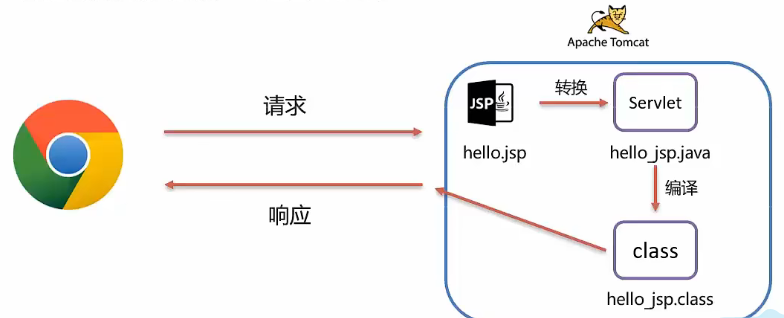

### JSP 脚本

用于再 JSP 页面内定义 Java 代码

- 脚本分类
  - `<%...%>`:内容会直接放到\_jspService()方法之中
  - `<%=...%>`:内容会放到 out.print()中,作为 out.print()的参数
  - `<%！...%>`:内容会放到\_jspService()方法之外，被类直接包含

### JSP 缺点

1. 书写麻烦
2. 阅读麻烦
3. 复杂度高：运行需要依赖于各种环境，JRE，JSP 容器，JavaEE
4. 占内存和磁盘：JSP 会自动生成.java 和.class 文件占磁盘，运行的是.class 文件占内存
5. 调试困难，出错后，需要找到自动生成的.java 文件进行调试

## EL 表达式

Expression Language 表达式语言，用于简化 JSP 界面的 Java 代码

- 主要功能：获取数据
- 语法：`${expression}`
- JavaWeb 中四大域对象
  - page：当前页面有效
  - request：当前请求有效
  - session：当前会话有效
  - application：当前应用有效

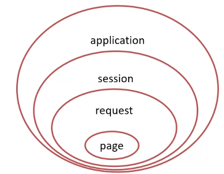

> **el 表达式获取数据，会依次从这四个域中寻找，直到找到位置**

### JSTL 标签

- JSP 标准标签库(JSP Standarded Tag Library),使用标签取代 JSP 页面上的 java 代码

#### <c:forEach>

相当于 for 循环

- items:被遍历的容器
- var：遍历产生的临时变量
- varStatus:遍历状态对象

  ```jsp
  <c:forEach items="${brands}" var="brand">
          <tr>
              <td>${brand.id}</td>
              <td>${brand.brandName}</td>
              <td>${brand.companyName}</td>
              <td>${brand.description}</td>
              <td>${brand.id}</td>
          </tr>
  </c:forEach>
  ```

- begin:开始数
- end：结束数
- step：步长

  ```jsp
  <c:forEach begin="0" end="10" step="1" var="i">
        ${i}
    </c:forEach>
  ```

## MVC 模式

MVC 是一种分层开发的模式，其中

- M：Model，业务模型，处理业务
- V:View，视图，界面展示
- C:Controller，控制器，处理请求，调用模型和视图

  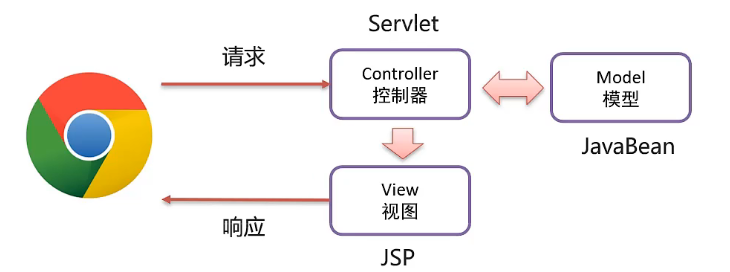

## 三层架构

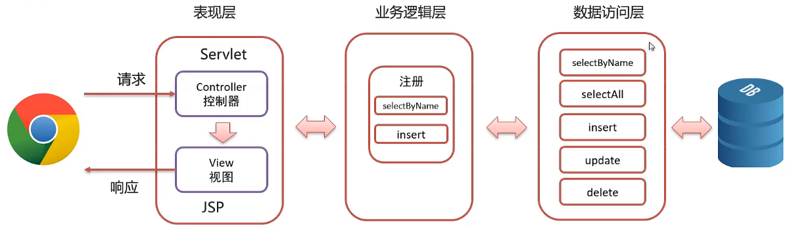

- 数据访问层(web/controller)：对数控尽快的 CRUD 基本操作，使用框架 SpringMVC/Struts2
- 业务逻辑层(service)：对业务逻辑进行封装，组合数据访问层中基本功能，形成复杂的业务逻辑功能，使用框架 Spring
- 表现层(dao/mapper)：接收请求，封装数据，调用业务逻辑层，响应数据，使用框架 MyBatis/Hibername

## 会话跟踪技术

- 会话：用户打开浏览器，访问 web 服务器的资源，会话建立，直到有一方断开连接，会话结束。在一次会话中可以包含多次请求和响应
- 会话跟踪：一种维护浏览器状态的方法，服务器需要识别多次请求是否来自于同一浏览器，以便再同一次会话的多次请求间**共享数据**
- HTTP 协议是**无状态**的，每次浏览器向服务器请求时，服务器都会将该请求视为新的请求，因此我们需要会话跟踪技术来实现会话内数据共享
- 实现方式
  - 客户端会话跟踪技术：Cookie
  - 服务端会话跟踪技术：Session

### Cookie

客户端会话技术，将数据保存早客户端，以后每次请求都携带 Cookie 数据进行访问

- 基本使用

  - 发送 Cookie

    - 创建 Cookie 对象，设置数据

      `Cookie cookie=new Cookie("usernmae","zhangsan");`

    - 发送 Cookie 到客户端：使用 response 对象

      `response.addCookie(cookie);`

  - 获取 Cookie

    - 获取客户端携带的所有 Cookie，使用 request 对象

      `Cookie[] cookies = request.getCookies();`

    - 遍历数组，获取每一个 Cookie 对象

      `for (Cookie cookie : cookies) {...}`

    - 使用 Cookie 对象方法获取数据

      ```java
      cookie.getName();
      cookie.getValue();
      ```

### Cookie 原理

- Cookie 的实现是基于 HTTP 协议的
  - 响应头：set-Cookie
  - 请求头：cookie

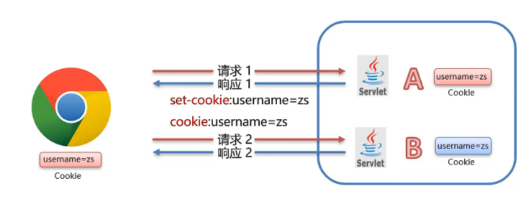

> Cookie 会根据从服务器端发送的响应报文内的一个叫做 Set-Cookie 的首部字段信息，通知客户端保存 Cookie。在同源策略下当浏览器再请求服务器时，浏览器把请求的网址连同该 Cookie 一同提交给服务器。服务器通过检查 Cookie 来获取用户状态

- Cookie 存活时间
  - 默认情况下，Cookie 存在在浏览器内存中，当浏览器关闭，内存释放，则 Cookie 被销毁
  - `setMaxAge(int seconds)`：设置 Cookie 存活时间
    1. 正数 ：将 Cookie 写入浏览器所在电脑的硬盘，持久化存储，到时间自动删除
    2. 负数：默认值，Cookie 在当前浏览器内存中，的浏览器关闭，则 Cookie 销毁
    3. 0：删除队友 Cookie

> Cookie 不能直接存储中文，如需要存贮，则需要使用 URL 编码进行转码

### Session

服务端会话跟踪技术，将数据保存到服务端，JavaEE 提供`HttpSession`接口，来实现一次会话的多次请求间数据共享功能

> 基本使用

1. 获取 Session 对象
2. Session 对象功能
   1. void setAttribute(String name,Object o):存储数据到 session 域中
   2. Object getAttribute(String name)：根据 key,获取值
   3. void removeAttribute(String name)：根据 key，删除该键值对

### Session 原理

Session 是基于 Cookie 实现的

### Session 使用细节

- 钝化：服务器正常关闭后，Tomcat 会自动将 Session 数据写入硬盘的文件中
- 活化：再次启动服务器后，从文件中加载数据到 Session 中

### Session 销毁

- 默认情况下，无操作，30 分钟自动销毁

  ```xml
  <session-config>
    <session-timeout>30</session-timeout>
  </session-config>
  ```

- 调用 Session 对象的 invalidat()方法

### 总结

- Cookie 和 Session 都是来完成一次会话内多次请求间数据共享的
- 区别
  - 存储位置：Cookie 是将数据存储在客户端，Session 将数据存储在服务端
  - 安全性：Cookie 不安全，Session 安全
  - 数据大小：Cookie 最大 3KB，Session 无大小限制
  - 存储时间：Cookie 可以长期存储，Sessin 默认 30 分钟
  - 服务器性能：Cookie 不占服务器资源，Session 占用服务器资源

## Filter

Filter 表示过滤器是 JavaWeb 三大组件(Servlet,Filter,Lisener)之一,可以把对资源的请求拦截下来，从而实现一些特殊的功能(权限控制，统一编码处理，敏感字符处理......)

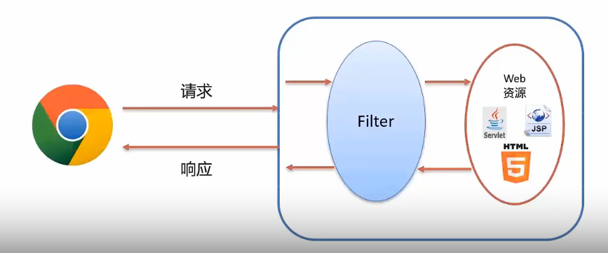

### Filter 使用步骤

1.定义类，实现 Filter 接口，并重写所有方法

```java
public class FilterDemo implements Filter {
 @Override
 public void init(FilterConfig filterConfig) throws ServletException {}
 @Override
 public void destroy() {}
 @Override
 public void doFilter(ServletRequest servletRequest, ServletResponse servletResponse, FilterChain filterChain) throws IOException, ServletException {
     System.out.println("FilterDemo running");
     filterChain.doFilter(servletRequest,servletResponse);
 }
}
```

2.配置 Filter 拦截资源的路径：在类上定义`@WebFilter`注解

```java
  @WebFilter("/*")
  public class FilterDemo implements Filter {...}
```

3.在 doFilter()中执行程序，并放行

```java
@Override
public void doFilter(ServletRequest servletRequest, ServletResponse servletResponse, FilterChain filterChain) throws IOException, ServletException {
    System.out.println("FilterDemo running");
    filterChain.doFilter(servletRequest,servletResponse);
}
```

### Filter 执行流程

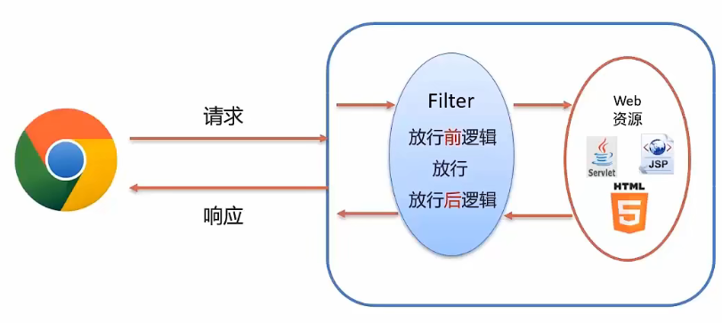

依次执行放行前逻辑，放行，访问资源，执行放行后逻辑

### Filter 拦截规则

Filter 可以根据需求，配置不同的拦截资源路径

```java
@WebFilter("/*")
public class FilterDemo{...}
```

- 拦截具体的资源： `/index.jsp`:只有访问 index.jsp 时才会被拦截
- 目录拦截： `/user/*`:访问/user 下的所有资源，都会被拦截
- 后缀名拦截： `*.jsp`:访问后缀名为 jsp 的资源，都会被拦截
- 拦截所有： `/*`:访问所有资源，都会被拦截

### 过滤器链

一个 web 应用，可以配置多个过滤器，这多个过滤器称为过滤器链

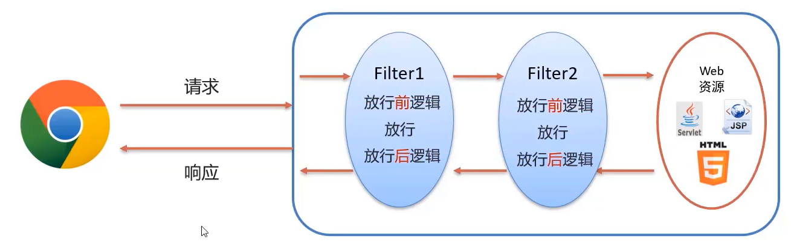

> 注解配置的 Filter，优先级按照过滤器类名的自然排序

## Listener

表示监听器，是 JavaWeb 三大组件之一，可以监听 application，session，request 三个对象创建，销毁或者往其中添加修改杉树属性时自动知道代码的功能组件

Listener 分类：JavaWeb 中提供了 8 个监听器

|     监听器分类      |                                                       监听器名称                                                        |                                                                                   作用                                                                                   |
| :-----------------: | :---------------------------------------------------------------------------------------------------------------------: | :----------------------------------------------------------------------------------------------------------------------------------------------------------------------: |
| ServletContext 监听 |                               ServletContextListener <br> ServletContextAttributeListener                               |                                    对于 ServletContext 对象进行监听(创建、销毁) <br> 对于 ServletContext 对象中属性的监听(增删改属性)                                    |
|    Session 监听     | HttpSessionListener <br> HttpSessionAttributeListener <br> HttpSessionBindingListener<br> HttpSessionActicationListener | 对于 Session 对象的整体状态进行监听(创建、销毁) <br>对于 Session 对象的属性的监听(增删改属性) <br>监听对象于 session 的绑定和接触 <br> 对 session 数据的钝化和活化的监听 |
|    Request 监听     |                               ServletRequestListener <br> ServletRequestAttributeListener                               |                                             对 Request 对象进行监听(创建、销毁) <br> 对 Request 对象中属性的监听(增删改属性)                                             |

- 使用步骤，以 ServletContextListener 为例

1. 定义类实现接口

   ```java
   public class ContextLoaderListener implements ServletContextListener {
      @Override
      public void contextInitialized(ServletContextEvent servletContextEvent) {
          System.out.println("ContextLoaderListener执行了");
      }

      @Override
      public void contextDestroyed(ServletContextEvent servletContextEvent) {

      }
    }
   ```

2. 在类上添加@WebListener 注解

   ```java
    @WebListener
    public class ContextLoaderListener implements ServletContextListener {...}
   ```

## AJAX

AJAX，异步的 JavaScrip 和 XML

- 作用

  - 和服务器进行数据交换：通过 AJAX 可以给服务器发送请求，并获取服务器响应的数据，使用 AJAX 和服务器进行通信，就可以使用 HTML+AJAX 来替换 JSP 页面了
  - 异步交互：在不重新加载整个页面的情况下，与服务器交换数据并更新部分网页的技术

- 异步和同步

  

- 使用步骤

1. 编写 AjaxServlet，并使用 response 输出字符串
2. 创建 XMLHttpRequest 对象，用于和服务器交换数据

   ```java
      var xHttp;
        if (window.XMLHttpRequest) {
            xHttp = new XMLHttpRequest();
        } else {
            // code for IE6, IE5
            xHttp = new ActiveXObject("Microsoft.XMLHTTP");
        }
   ```

3. 向服务器发送请求

   ```java
      xHttp.open("GET", url );
      xHttp.send();
   ```

4. 获取服务响应数据

   ```java
      xHttp.onreadystatechange = function() {
        if (this.readyState == 4 && this.status == 200) {
          document.getElementById("demo").innerHTML =
            alert(this.responseText);
        }
      };
   ```

## Axios 异步框架

对原生的 AJAX 进行封装，简化书写

使用步骤

1. 引入 axios 的 js 文件

   ```html
   <script src="https://cdn.jsdelivr.net/npm/axios/dist/axios.min.js"></script>
   ```

2. 使用 axios 发送请求，并获取响应结果

   ```html
   <!-- get请求 -->
   <script>
     axios({
       method: "get",
       url: "url?name=zs",
     }).then(function (resp) {
       alert(resp.data);
     });
   </script>

   <!-- post请求 -->
   <script>
     axios({
       method: "post",
       url: url,
       data: "name=sz",
     }).then(function (resp) {
       alert(resp.data);
     });
   </script>
   ```

### Axios 请求别名

|       方法名       |      作用      |
| :----------------: | :------------: |
|      get(url)      | 发起 GET 请求  |
| post(url,请求参数) | 发起 POST 请求 |

```html
<script>
  axios.get(url).then(function (resp) {
    alert(resp.data);
  });
</script>

<script>
  axios.post(url, 参数).then(function (resp) {
    alert(resp.data);
  });
</script>
```

## JSON

JavaScript Object Notation，JavaScript 对象标识法，语法简单，层次结构鲜明，现多用于数据载体，在网络中进行数据传输

### JSON 基础语法

- 定义：

  ```json
    var 变量名={"key1":value1,
                "key2":value2,
                ...
              };
    示例：
    var json={
      "name":"zhangsan",
      "age":23,
      "addr":["北京"]
    };

  ```

> value 的数据类型为
>
> - 数字(整数或浮点数)
> - 字符串(双引号中)
> - 逻辑值(true 或者 false)
> - 数组(方括号中)
> - 对象(花括号中)
> - null

- 获取数据

  ```json
    变量名.key
    json.name
  ```

### JSON 数据和 Java 对象转换

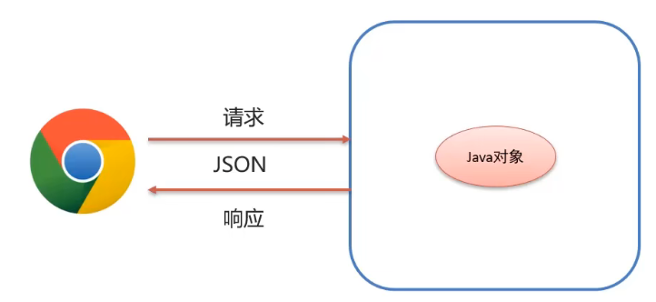

- 请求数据：JSON 字符串转为 Java 对象
- 响应数据：Java 对象转为 JSON 字符串

- Fastjson 是一个 Java 语言编写的 JSON 库，实现 Java 对象和 JSON 字符串的相互转化
- 使用

  - 导入坐标

    ```xml
      <dependency>
        <groupId>com.alibaba</groupId>
        <artifactId>fastjson</artifactId>
        <version>1.2.62</version>
      </dependency>
    ```

  - Java 对象转 JSON

    `String jsonString = JSON.toJSONString(user);`

  - JSON 字符串转 Java 对象

    `User u = JSON.parseObject("{\"id\":1,\"name\":\"wz\",\"password\":\"123\"}", User.class);`
