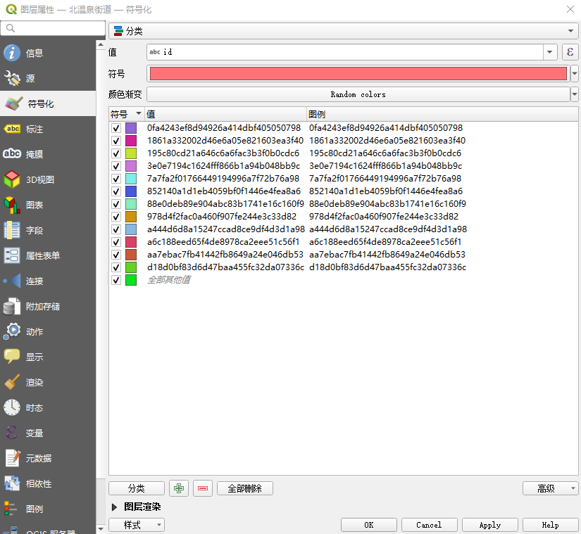

<!--
 * @Date: 2022-07-21 16:15:08
 * @LastEditTime: 2022-07-21 16:45:21
 * @FilePath: \学习笔记\QGIS\QGIS基本使用.md
-->
# QGIS在综治网格中的基本使用

## 设置不同网格颜色对比

打开图层属性---->符号化

页面最上方的第一个下拉菜单选择分类,值是分类的依据，符号意义不明，颜色渐变选择随机颜色，点击分类，然后apply

下面的图层渲染可以设置不透明度

## 输出图片

工程--->打印新布局(Ctrl+P),

在新窗口中选择添加项--->添加地图，鼠标变成十字架，按住在画布上画出区域，调整至合适大小,导出为图片即可