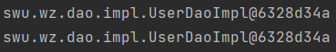
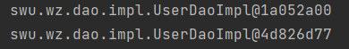
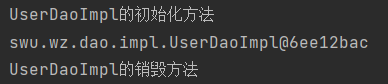
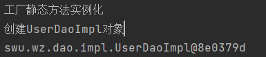
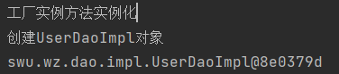
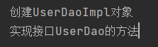
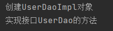
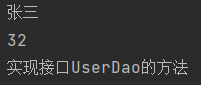
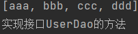

# SSM框架

[toc]

## Spring

Spring是分层的Java SE/EE应用full-stack轻量级开源框架，以loc(Inverse Of Control:反转控制)和AOP(Aspect Oriented Programming:面向切面编程)为内核，提供了展现层SpringMVC和持久层Spring JDBCTemplate以及业务层事务管理等众多企业级应用技术，还能整合开源世界众多著名的第三方框架和类库。

### Spring的优势

1. 方便解耦，简化开发  
   通过Spring 提供的loC容器，可以将对象间的依赖关系交由Spring进行控制，避免硬编码所造成的过度耦合。用户也不必再为单例模式类、属性文件解析等这些很底层的需求编写代码，可以更专注于上层的应用。
2. AOP编程的支持  
   通过Spring的AOP功能，方便进行面向切面编程，许多不容易用传统OOP实现的功能可以通过AOP轻松实现。
3. 声明式事务的支持  
   可以将我们从单调烦闷的事务管理代码中解脱出来，通过声明式方式灵活的进行事务管理，提高发效率和质量。
4. 方便程序的测试  
   可以用非容器依赖的编程方式进行几乎所有的测试工作，测试不再是昂贵的操作，而是随手可做的事情。
5. 方便集成各种优秀框架  
   Spring对各种优秀框架（Struts、Hibermate、Hessian、Quarz等）的支持。
6. 降低JavaEE API的使用难度  
   Spring对JavaEEAPI（如JDBC、JavaMail、远程调用等）进行了薄薄的封装层，使这些API的使用难度大为降低。
7. JAVA源码是学习的经典案例  
   Spring的源代码设计精妙、结构清晰、匠心独用，处处体现着大师对Java设计模式灵活运用以及对Java技术的高深造诣。它的源代码无意是Java技术的最佳实践的范例。

### Spring开发基本步骤

- pom.xml文件中导入Spring开发的基本包坐标

```js
<dependencies>
        <dependency>
            <groupId>org.springframework</groupId>
            <artifactId>spring-context</artifactId>
            <version>5.0.15.RELEASE</version>
        </dependency>
</dependencies>
```

- 编写Dao接口和实现类

```java
public interface UserDao {
    public void save();
}
public class UserDaoImpl implements UserDao {
    @Override
    public void save() {
        System.out.println("实现接口UserDao的方法");
    }
}
```

- 创建Spring核心配置文件applicationContext.xml并配置UserDaolmpl

```js
<bean id="UserDao" class="swu.wz.dao.impl.UserDaoImpl"></bean>
```

- 使用Spring的API获得Bean 实例

```java
public static void main(String[] args) {
        ApplicationContext applicationContext = new ClassPathXmlApplicationContext("applicationContext.xml");
        UserDao userDao = (UserDao) applicationContext.getBean("UserDao");
        userDao.save();
    }
```

### Spring配置文件

#### bean标签基本配置

用于配置对象交由Spring来创建，默认情况下调用的是类中的无参构造函数，若没有无参构造函数则不能创建成功，**默认情况必须保证存在无参构造函数**

- 基本属性
  - id:bean实例在Spring容器中的唯一标识
  - class:bean的全限定名称

#### bean标签范围配置

scope：指对象的作用范围，取值如下

|    取值范围    |                                      说明                                      |
| :------------: | :----------------------------------------------------------------------------: |
|   singleton    |                             默认值，单例,单个对象                              |
|   prototype    |                                多例的，多个对象                                |
|    request     |           web项目中，Spring创建一个bean对象，将对象存入到request域中           |
|    session     |           web项目中，Spring创建一个bean对象，将对象存入到session域中           |
| global session | web项目中，应用在Portlet环境，若无Portlet环境那么global session相当于  session |

测试代码

```java
 public static void main(String[] args) {
        ApplicationContext applicationContext = new ClassPathXmlApplicationContext("applicationContext.xml");
        UserDao userDao1 = (UserDao) applicationContext.getBean("UserDao");
        UserDao userDao2 = (UserDao) applicationContext.getBean("UserDao");
        System.out.println(userDao1);
        System.out.println(userDao2);
    }
```

当scope的取值为singleton

```js
<bean id="UserDao" class="swu.wz.dao.impl.UserDaoImpl" scope="singleton"></bean>
// scope默认的取值也是singleton
```

运行代码得到



- bean的实例化个数：1个
- **bean的实例化时机：当Spring核心文件被加载时，实例化配置的bean实例**
- bean的生命周期
  - 对象创建：当应用加载，创建容器时，对象就被创建了
  - 对象运行：只要容器在，对象一直或者
  - 对象销毁：当应用卸载，销毁容器时，对象就被销毁了

当scope的取值为prototype

```js
<bean id="UserDao" class="swu.wz.dao.impl.UserDaoImpl" scope="prototype"></bean>
```

输出



- bean的实例化个数：多个
- **bean的实例化时机：当调用getBean()方法时实例化Bean**
  - 对象创建：当应用加载，创建容器时，对象就被创建了
  - 对象运行：只要容器在，对象一直或者
  - 对象销毁：当对象长时间不用时，被JAVA的垃圾回收器回收了

#### bean生命周期配置

- init-method：指定类中的初始化方法名称
- destroy-method：指定类中销毁方法名称

```<bean id="UserDao" class="swu.wz.dao.impl.UserDaoImpl" init-method="init" destroy-method="destroy"></bean>```

```java
public static void main(String[] args) {
        ClassPathXmlApplicationContext applicationContext = new ClassPathXmlApplicationContext("applicationContext.xml");
        UserDao userDao = (UserDao) applicationContext.getBean("UserDao");
        applicationContext.close();
}
```

运行代码得到结果



---

#### bean实例化三种方式

通用代码

```java
public class UserDaoImpl implements UserDao {
    public UserDaoImpl() {
        System.out.println("创建UserDaoImpl对象");
    }
}
public class UserDaoDemo {
    public static void main(String[] args) {
        ClassPathXmlApplicationContext applicationContext = new ClassPathXmlApplicationContext("applicationContext.xml");
        UserDao userDao = (UserDao) applicationContext.getBean("UserDao");
        System.out.println(userDao);
        applicationContext.close();
    }
}
```

- 无参构造方法实例化

```js
<bean id="UserDao" class="swu.wz.dao.impl.UserDaoImpl" >... </bean>
```

```java

```

- 工厂静态方法实例化

Spring在解析的时候，发现factory-method的参数，直接执行全包名对应的内部的指定方法

```xml
<bean id="UserDao" class="swu.wz.factory.StaticFactory" factory-method="getUserDao">...</bean>
```

```java
public class StaticFactory {
    public static UserDao getUserDao(){
        System.out.println("工厂静态方法实例化");
        return new UserDaoImpl();
    }
}
```

运行结果



- 工厂实例方法实例化

先使用Spring创建一个factory对象，再引用factory对象( factory-bean)，调用对象中的方法(factory-method)获得指定的对象

```xml
<bean id="factory" class="swu.wz.factory.DynamicFactory">...</bean>
<bean id="UserDao" factory-bean="factory" factory-method="getUserDao">...</bean>
```

```java
public class DynamicFactory {
    public UserDao getUserDao(){
        System.out.println("工厂实例方法实例化");
        return new UserDaoImpl();
    }
}
```

运行结果



#### bean的依赖注入

>在Spring容器中存在多个实例，它们相互调用了方法，但在外部程序中我们只需要用到这其中某一个实例，所以可以在容器中将一个实例设置到另一个实例内部  

依赖注入是Spring框架核心的ioc的具体实现  
Spring框架的核心功能有两个：

- Spring容器作为超级大工厂，负责创建、管理所有的Java对象，这些Java对象被称为Bean。
- Spring容器管理容器中Bean之间的依赖关系，Spring使用一种被称为"依赖注入"的方式来管理Bean之间的依赖关系

使用依赖注入，不仅可以为Bean注入普通的属性值，还可以注入其他Bean的引用。依赖注入是一种优秀的解耦方式，其可以让Bean以配置文件组织在一起，而不是以硬编码的方式耦合在一起

#### bean的依赖注入方式

- 构造方法  
利用构造器来设置依赖关系的方式，被称为构造注入。通俗来说，就是驱动Spring在底层以反射方式执行带指定参数的构造器，当执行带参数的构造器时，就可利用构造器参数对成员变量执行初始化——这就是构造注入的本质。

```XML
<bean id="userDao" class="swu.wz.dao.impl.UserDaoImpl"></bean>
<bean id="userService" class="edu.swu.wz.service.impl.UserServiceImpl">
   <constructor-arg 
   name="userDao" //此处的userDao是构造内部的参数名
   ref="userDao"  //引用容器的bean的id/>
</bean>
```

在创建对象时通过有参构造将userDao注入，UserServiceImpl()接收，将对象赋给属性userDao,调用save()方法时，userDao就不为空

测试代码

```java
public class UserController {
    public static void main(String[] args) {
        ApplicationContext app = new ClassPathXmlApplicationContext("applicationContext.xml");
        UserService userService = (UserService) app.getBean("userService");
        userService.save();
    }
}
```

得到结果：



- set方法  
指IoC容器通过成员变量的setter方法来注入被依赖对象。这种注入方式简单、直观，因而在Spring的依赖注入里大量使用。

``` xml
<bean id="userDao" class="swu.wz.dao.impl.UserDaoImpl"></bean>
    <bean id="userService" class="swu.wz.service.impl.UserServiceImpl">
        <property name="userDao" ref="userDao"></property>
   </bean>
```

```java
public class UserServiceImpl implements UserService {
    private UserDao userDao;
    public void setUserDao(UserDao userDao) {
        this.userDao = userDao;
    }
    @Override
    public void save() {
        userDao.save();
    }
}
public class UserController {
    public static void main(String[] args) {
        ApplicationContext app = new ClassPathXmlApplicationContext("applicationContext.xml");
        UserService userService = (UserService) app.getBean("userService");
        userService.save();
    }
}
```

运行结果为



> P命名空间注入

P命名空间注入的本质也是set方法注入，但比起上述的set方法注入更方便，主要体现在配置文件中，如下

```js
xmlns:p ="http://www.springframework.org/schema/p" //引入命名空间
```

其次需要修改注入方式

```js
<bean id="userService" class="edu.swu.wz.service.impl.UserServiceImpl" p:userDao-ref="userDao"></bean>
```

#### bean的依赖注入的数据类型

处了对象的引用可以注入跑，普通数据类型，集合等都可以在容器中进行注入  
注入数据的三种数据类型

> 普通数据类型

在userDao实现接口中加入私有属性

```java
public class UserDaoImpl implements UserDao {
    private String username;
    private int age;
    @Override
    public void save() {
        System.out.println(username);
        System.out.println(age);
        System.out.println("实现接口UserDao的方法");
    }
}
```

配置xml文件

```xml
<bean id="userDao" class="swu.wz.dao.impl.UserDaoImpl">
       <!-- set注入，在类中需要有相关的set函数-->
       <!-- <property name="username" value="张三"/> -->
       <!-- <property name="age" value="32"/> -->
       <!-- 构造注入，在类中需要有构造函数 -->
        <constructor-arg name="username" value="张三"/>
        <constructor-arg name="age" value="32"/>
</bean>
<bean id ="userService" class="swu.wz.service.impl.UserServiceImpl">
      <constructor-arg name="userDao" ref="userDao"></constructor-arg>
</bean>
```

执行得到



> 引用数据类型  

在userService中注入userDao相同

> 集合数据类型

```java
public class UserDaoImpl implements UserDao {
    private List<String> strList;
    @Override
    public void save() {
        System.out.println(strList);
        System.out.println("实现接口UserDao的方法");
    }
}
```

xml配置

```xml
<bean id="userDao" class="swu.wz.dao.impl.UserDaoImpl">
        <property name="strList">
            <list>
                <value>aaa</value>
                <value>bbb</value>
                <value>ccc</value>
                <value>ddd</value>
            </list>
        </property>
    </bean>
```

得到结果



### 引入其他配置文件

实际开发中Spring的配置内容非常多，导致Spring配置很繁杂且体积很大，所以可以将部分配置拆解到其他配置文件中，而在Spring主配置文件通过import表亲进行加载

```js
<import srecource="applicationContext-xxx.xml">
```

### Spring重点配置

- \<bean>
  - id:在容器中bean实例的唯一标识，不允许重复
  - class：实例化的bean全限定名
  - scope：搬到作用范围，常用的油singleton(默认)和prototype
  - \<property>:属性注入
    - name：属性名称
    - value:注入的普通属性值
    - ref:注入的对象引用值
    - \<list>标签
    - \<map>标签
    - \<properties>标签
  - \<constructor-arg>标签(有参构造)
- \<import>标签

### Spring相关API

#### ApplicantionContext的实现类

- ClassPathXmlApplicationContext

从类的根路径下加载配置文件(推荐使用)

- FileSystemXmlApplicationContext

从磁盘路径上加载配置文件，配置文件可以在磁盘的任意位置

- AnnotationConfigApplicationContext

使用注解配置容器对象时，需要使用此类来创建Spring容器，用它来读取注解
  
#### getbean()参数

- getbean(id):容器中某一类型的bean存在多个，使用此方式
- getbean(Class)容器中某一类型的bean净存在一个，使用此方式

### Spring配置数据源

#### 作用

- 数据源是提高程序性能出现
- 事先实例化数据源，初始化部分连接资源
- 使用连接资源时，从数据源获取
- 使用完完毕后将链接资源归还给数据源
  
常见的数据源：DBCP,C3P0,BoneCP,Druid等

#### 开发步骤

1. 导入数据的坐标和数据库驱动
2. 创建数据源对象
3. 获取数据源的基本链接数据
4. 使用数据源获取链接资源和归还连接资源

- 手动创建c3p0数据源

```java
public void test1() throws Exception {
   ComboPooledDataSource dataSource = new ComboPooledDataSource();
   dataSource.setDriverClass("com.mysql.jdbc.Driver");
   dataSource.setJdbcUrl("jdbc:mysql://localhost:3306/test");
   dataSource.setUser("root");
   dataSource.setPassword("root");
   Connection connection = dataSource.getConnection();
   System.out.println(connection);
   connection.close();  //打印地址证明连接成功
}
```

- 手动创建druid数据源

```java
@Test
public void test2() throws Exception {
   DruidDataSource dataSource = new DruidDataSource();
   dataSource.setDriverClassName("com.mysql.jdbc.Driver");
   dataSource.setUrl("jdbc:mysql://localhost:3306/test");
   dataSource.setUsername("root");
   dataSource.setPassword("root");
   Connection connection = dataSource.getConnection();
   System.out.println(connection);
   connection.close();
}
```

- 测试通过加载properties配置文件创建 c3p0数据源

```java
public void test3() throws Exception {
   ResourceBundle rb =  ResourceBundle.getBundle("jdbc");
   String driver = rb.getString("jdbc.driver");
   String url = rb.getString("jdbc.url");
   String username = rb.getString("jdbc.username");
   String password = rb.getString("jdbc.password");

   //创建数据源对象，设置连接参数
   ComboPooledDataSource dataSource = new ComboPooledDataSource();
   dataSource.setDriverClass(driver);
   dataSource.setJdbcUrl(url);
   dataSource.setUser(username);
   dataSource.setPassword(password);
   Connection connection = dataSource.getConnection();
   System.out.println(connection);
   connection.close();
}
```

#### 使用Spring配置数据源

可以将DataSource的创建权交由Spring容器去完成

- ApplicationContext.xml配置如下

```js
<bean id="dataSource" class="com.mchange.v2.c3p0.ComboPooledDataSource">
   <property name="driverClass" value="com.mysql.jdbc.Driver"/>
   <property name="jdbcUrl" value="jdbc:mysql://localhost:3306/test"/>
   <property name="user" value="root"/>
   <property name="password" value="root"/>
</bean>
```

- Spring容器产生数据源对象

```java
public void test4() throws Exception {
   ApplicationContext app = new ClassPathXmlApplicationContext("applicationContext.xml");
   // 两种获取参数方法
   DataSource dataSource = (DataSource) app.getBean("dataSource");
// DataSource dataSource = app.getBean(DataSource.class);
   Connection connection = dataSource.getConnection();
   System.out.println(connection);
   connection.close();
}
```

### 抽取jdbc配置文件

applicationContext.xml加载jdbc.properties配置文件获得连接信息  
首先，需要引入context命名空间和约束路径

- 命名空间:```xmlns:context="http://www.springframework.org/schema/context"```
- 约束路径:```http://www.springframework.org/schema/context http://www.springframework.org/schema/context/spring-context.xsd```

```js
<bean id="dataSource" class="com.alibaba.druid.pool.DruidDataSource">
   <property name="driverClassName" value="${jdbc.driver}"/>
   <property name="url" value="${jdbc.url}"/>
   <property name="username" value="${jdbc.username}"/>
   <property name="password" value="${jdbc.username}"/>
</bean>
```

- Spring容器加载properties文件

```xml
<context:property-placeholder location="classpath:jdbc.properties"/>
<property name=" " value="${key}"/>
```

## Spring注解开发

### 原始注解

Spring的原始注解主要替代的是\<bean>的配置

|      注解       |                      说明                       |
| :-------------: | :---------------------------------------------: |
| **@Component**  |            使用在类上用于实例化bean             |
| **@Controller** |          使用在web层类上用于实例化bean          |
|  **@Service**   |        使用在service层类上用于实例化bean        |
| **@Repository** |          使用在dao层类上用于实例化bean          |
| **@Autowired**  |        使用在字段上用于根据类型依赖注入         |
| **@Qualifier**  | 结合@Autowired 一起使用用于根据名称进行依赖注入 |
|  **@Resource**  |  相当于@Autowired+@Autowired，按照名称进行注入  |
|   **@Value**    |                  注入普通属性                   |
|   **@Scope**    |               标注bean的作用范围                |
| @PostConstruct  |    使用在方法上标注该方法是bean的初始化方法     |
|   @PreDestroy   |     使用在方法上标注该方法是bean的销毁方法      |

>**注意:使用注解进行开发时需要在xml文件配置组件扫描,作用是指定那个包及其子包下单bean需要进行扫码以便识别使用注解配置的类、字段和方法**

```xml
<!--配置组件扫描-->
<context:component-scan base-package="edu.swu.wz"/>
```

```java
@Component("userDao")
// 注解，等价于在XML文件中配置
// <bean id="userDao" class="swu.wz.dao.impl.UserDaoImpl"/>
public class UserDaoImpl implements UserDao {...}
// 下面代码等价于
// <bean id="userService" class="swu.wz.service.impl.UserServiceImpl">
//         <property name="userDao" ref="userDao"></property>
// </bean>
@Component("userService")
public class UserServiceImpl implements UserService {
    @Autowired             //注入
    @Qualifier("userDao")  //选择id
    private UserDao userDao;
    ...
}
```

> 注入普通数据类型

```js
@Value("数据值")
private String driver;  //此时driver的值就是数据值，可以结合setting属性使用，如${"jdbc.driver"}，这是主要用途
```

### 新注解

原始注解不能全部替代xml文件，还需要使用注解替代的配置如下：

- 非自定义的bean的配置：\<bean>
- 加载properties文件的配置：\<context:property-placeholder>
- 组件扫描的配置：\<context:component-scan>
- 引入其他文件：\<import>

|       注解       |                                说明                                |
| :--------------: | :----------------------------------------------------------------: |
| \@Configuration  | 用于指定当前类是一个Spring配置类，当创建容器时，会从该类上加载注解 |
| \@ComponentScan  |               用于指定Spring在初始化容器时要扫描的包               |
|      \@Bean      |        使用在方法上，标注将该方法的返回值存储到Spring容器中        |
| \@PropertySource |                   用于加载properties文件中的配置                   |
|     \@Import     |                         用于导入其他配置类                         |

## Spring整合JUnit

- 让SpringJunit负责创建Spring容器，但需要将配置文件的名称告诉它
- 将需要进行测试bean直接在测试类中进行注入

### Spring继承Junit步骤

1. 导入Spring集成Junit的坐标
2. 使用@Runwith注解替换原来的运行期
3. 使用@ContextConfiguration指定配置文件或类
4. 使用@Autowired注入需要测试的对象
5. 创建测试方法进行测试
