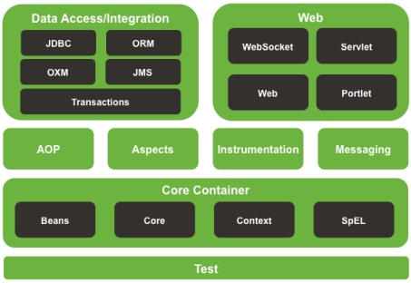

<!--
 * @Author: WangZhao wz1847584786@163.com
 * @Date: 2022-06-27 21:07:47
 * @LastEditors: WangZhao wz1847584786@163.com
 * @LastEditTime: 2022-06-28 20:32:10
 * @FilePath: \LeetCoded:\Document\学习笔记\Spring\Spring.md
 * @Description: 
 * 
 * Copyright (c) 2022 by WangZhao wz1847584786@163.com, All Rights Reserved. 
-->
# Spring

## Spring Framework 系统架构



- Data Access:数据访问
- Data Integration:数据集成
- Web:Web开发
- AOP:面向切面编程
- Aspects:AOP思想实现
- Core Container:核心容器
- Test:单元测试与集成测试

## 核心概念

- IoC(Inversion of Control) 控制反转
  - 使用对象时,由主动new产生对象转换为由**外部**提供对象,此过程中对象创建控制权由程序转移到**外部**,此思想称为控制反转.Spring对IoC思想进行了实现,提供了一个容器,称为IoC容器,用来充当IoC思想中的外部
  - IoC容器负责对象的创建,初始化等一系列工作,被创建或被管理的对象在IoC容器中统称为Bean
- DI(Dependency Injection) 依赖注入
  - 在容器中建立bean与bean之间依赖关系的整个过程,称为依赖注入

> 最终目标:使用对象时不仅可以直接从IoC容器中获取,并且渠道的bean已经绑定了所有的依赖关系

### IoC入门步骤

1. 导入Spring坐标

   ```xml
    <dependencies>
        <dependency>
            <groupId>org.springframework</groupId>
            <artifactId>spring-context</artifactId>
            <version>5.3.20</version>
        </dependency>
    </dependencies>
   ```

2. 定义Spring 管理的类和接口

   ```java
      public interface BookService {
        public void save();
      }
      public class BookServiceImpl implements BookService {
          private BookDao bookDao = (BookDao) new BookDaoImpl();
          public void save()
          {
              System.out.println("BookService.....");
              bookDao.run();
          }
      }
   ```

3. 创建Spring配置文件,配置对应类作为Spring管理的Bean

   ```xml
      <beans xmlns="http://www.springframework.org/schema/beans"
       xmlns:xsi="http://www.w3.org/2001/XMLSchema-instance"
       xsi:schemaLocation="http://www.springframework.org/schema/beans http://www.springframework.org/schema/beans/spring-beans.xsd">
        <!--配置Bean-->
        <bean id="bookService" class="wz.service.impl.BookServiceImpl"/>
    </beans>
   ```

4. 初始化IoC容器,通过容器获取bean

  ```Java
    public class App2 {
      public static void main(String[] args) {
          ApplicationContext app=new ClassPathXmlApplicationContext("applicationContext.xml");
          BookService bookService = (BookService) app.getBean("bookService");
          bookService.save();
      }
    }
  ```

## Bean配置

### Bean基础配置

|类别|描述|
|:-:|:-:|
|名称|bean|
|类型|标签|
|所属|beans标签|
|功能|定义Spring核心容器管理的对象|
|格式|\<beans><br>&emsp;\<bean><br>&emsp;\<bean><br>\</beans>|
|属性列表|id:bean的id,使用容器可以通过id值获取对应的bean,在一个容器中id值唯一;<br>class:bean的类型,及配置的bean的全路径类名|
|范例|\<bean id="bookDao"  class="wz.dao.impl.BookDaoImpl"/><br>\<bean id="bookService" name="Service" class="wz.service.impl.BookServiceImpl">\</bean>|

### Bean别名配置

|类别|描述|
|:-:|:-:|
|名称|name|
|类型|属性|
|所属|bean标签|
|功能|定义bean的别名,可定义多个,使用逗号(,)分号(;)空格()分隔|
|范例|\<bean id="bookDao" name="dao bookDaoImpl  class="wz.dao.impl.BookDaoImpl"/><br>\<bean id="bookService" name="Service Service2 Service3" class="wz.service.impl.BookServiceImpl">\</bean>|

> 注意:获取bean无论是通过id还是name获取,无法获取到将抛出异常NoSuchBeanDefinitionException

### Bean作用范围配置

|类别|描述|
|:-:|:-:|
|名称|scope|
|类型|属性|
|所属|bean标签|
|功能|定义bean的作用范围:1.singleton:单例(默认) 2.prototype:非单例|
|范例|\<bean id="bookService" class="wz.service.impl.BookServiceImpl" scope="prototype"></bean>|

> 为什么bean默认为单例?
  如果一个bean被声明为单例的时候，在处理多次请求的时候在Spring容器里只实例化出一个bean，后续的请求都公用这个对象，这个对象会保存在一个map里面。当有请求来的时候会先从缓存(map)里查看有没有，有的话直接使用这个对象，没有的话才实例化一个新的对象.由于不会每次都新创建新对象所以有一下几个性能上的优势：**1.减少了新生成实例的消耗.2.减少jvm垃圾回收.3.可以快速获取到bean;但是劣势就是不能做到线程安全！！！**

- 适合交给容器进行管理的bean
  - 表现层对象
  - 业务层对象
  - 数据层层对象
  - 工具对象
- 不适合交给容器进行管理的bean
  - 封装实体的域对象

## Bean实例化

bean本质上是对象,创建bean使用构造方法完成

### 构造方法(常用)

- 提供可访问的构造方法

  ```java
      public class BookDaoImpl implements BookDao {
          public BookDaoImpl() {
              System.out.println("BookDaoImpl Constructor");
          }

          public void run() {
              System.out.println("BookDaoImpl...");
          }
      }
  ```

- 配置

  ```xml
    <bean id="bookDao"  class="wz.dao.impl.BookDaoImpl"/>
  ```

- **无参构造方法如果不存在,将抛出异常BeanCreationExcepting**

### 静态工厂实例化

- 静态工厂

  ```java
      public class OrderDaoFactory {
          public static OrderDao getOrderDao(){
              System.out.println("factory setup....");
              return new OrderDaoImpl();
          }
      }
  ```

- 配置

  ```xml
      <bean
          id="orderDao"
          class="wz.factory.OrderDaoFactory"
          factory-method="getOrderDao"/>
  ```
