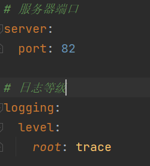
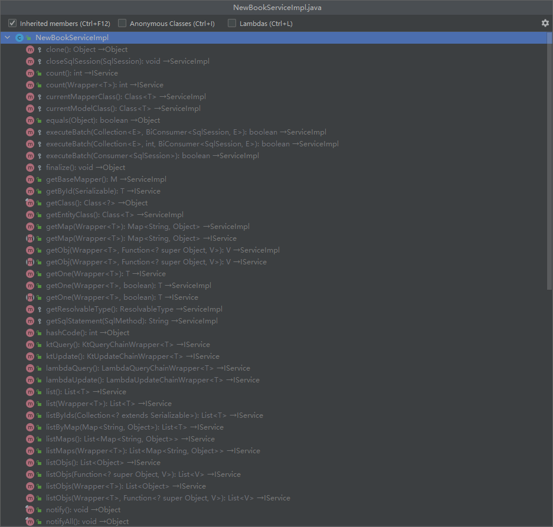

<!--
 * @Author: WangZhao wz1847584786@163.com
 * @Date: 2022-06-28 21:21:54
 * @LastEditors: error: git config user.name && git config user.email & please set dead value or install git
 * @LastEditTime: 2022-07-04 21:34:57
 * @FilePath: \undefinedd:\Documents\学习笔记\SpringBoot\SpringBoot.md
 * @Description: 
 * 
 * Copyright (c) 2022 by WangZhao wz1847584786@163.com, All Rights Reserved. 
-->
# SpringBoot

## 四个基础概念

### parent

  1. 开发SpringBoot程序要继承spring-boot-starter-parent
  2. spring-boot-starter-parent中定义了若干个依赖挂你了
  3. 集成parent模块可以避免多个依赖使用相同技术时出现依赖版本冲突
  4. 集成parent的形式也可以采用引入依赖的形式实现效果

### starter

  1. 开发SpringBoot程序需要导入坐标时通常导入对应的starter
  2. 每个不同的starter根据功能不同,通常包含多个依赖坐标
  3. 使用starter可以实现快速配置的效果,达到简化配置的目的

### 引导类

- SpringBoot的引导类时Boot工程的执行入口,运行main方法就可以启动项目
- SpringBoot工程运行后初始化Spring容器,扫描引导类所在包加载bean

### 内嵌tomcat

1. 内嵌tomcat服务器是SpringBoot辅助功能之一
2. 内嵌tomcat工作原理是将Tomcat服务器作为对象运行,并将该对象交给Spring容器管理
3. 变更内嵌服务器思想是去除现有服务器,添加全新的服务器

- tomcat:默认,apache出品,应用面广,负载量若干较重的组件)
- jetty :更轻量级,负载性能远不及tomcat
- undertow:负载性能和tomcat相差不大

## 基础配置

### 复制工程

- 原则
  - 保留工程基础结构
  - 抹掉原始工程痕迹

1. 在工作空间中复制对应工程,并修改工程名称
2. 删除与Idea相关配置文件,仅保留src目录与pom.xml文件
   
3. 修改pom.xml文件中的artifactId与新工厂/模块名相同
   
4. 删除name标签(可选)
   
5. 保留备份工程备后期使用

### 属性配置

SpringBoot默认配置文件application.properties,通过键值对配置对应属性


- 修改服务器端口

  ```properties
    server.port=80
  ```

- 关闭运行日志图标(banner)

  ```properties
    spring.main.banner-mode=off
  ```

- 设置日志相关

   ```properties
    logging.level.root=error
  ```

> 关于SpringBoot的配置项,详情访问Spring官方网页[Application Properties](https://docs.spring.io/spring-boot/docs/current/reference/html/application-properties.html)

SpringBoot提供了3种配置文件的格式(以修改端口为例子)

1. properties(传统/默认格式)

    ```properties
      server.port=80
    ```

2. yml(主流格式)

    ```yml
      server:
        port: 82
    ```

3. yaml

    ```yaml
      server:
        port: 82
    ```

> 优先级:当项目中同时存在三种配置文件时,配置文件重叠的部分会覆盖(优先级:properties>yml>yaml),不相同的属性会留下

## YAML

YAML,一种数据序列化格式

- 优点
  - 容易阅读
  - 容易与脚本语言交互
  - 与数据为核心,重数据轻格式
- YAML文件扩展名
  - .yaml
  - .yml(主流)
- 语法规则
  - 大小写敏感
  - 属性层级关系使用多行描述,每行结尾使用冒号结束
  - 使用缩进表示层级关系,同层级左侧对其,只允许使用空格(不允许使用Tab)
  - **属性值前面添加空格(属性名与属性值之间使用冒号+空格作为分隔)**
  - 使用 # 表示注释
  
  - [子面值/对象数据格式/数组主句格式查看](https://www.runoob.com/w3cnote/yaml-intro.html)

### YAML单个数据读取

- 使用`@Value`读取单个数据,属性名引用方式:`${一级属性名.二级属性名...}`
  
- 如果数据存在多层级,依次书写层级名称即可
- 配置文件中可以使用属性名引用的方式引用属性
  
- 如果属性中需要特殊字符的作用,可以可以使用双引号包裹起来作为字符解析
  

### YAML全部数据读取

1. 使用`Environment`对象封装全部配置信息
2. 使用`@Autowired`自动装配数据到`Environment`对象中
   

### 自定义对象封装数据

1. 自定义要封装的数据

   ```yaml
    user1:
      name: ZhangSan
      age: 16
   ```

2. 创建同名封装类并使用`@Component`注解指定为Spring管控的Bean,否则无法进行属性注入
3. 使用`@ConfigurationProperties`注解绑定配置信息到封装类中

   ```java
      @Component      //指定为Spring管控的Bean
      @ConfigurationProperties(prefix = "user1")//指定加载的数据
      public class user1 {
          private String name;
          private String age;
      }
   ```

## 整合第三方技术

### 整合JUnit

- 名称:@SpringBootTest
- 类型:测试类注解
- 位置:测试类定义上方
- 作用设置JUnit加载的SpringBoot启动类

```java
    @Repository  //对象交给spring管理。@Repository用在持久层的接口上,也可以使用@Component,此处@Repository 更合理
    public class BookDaoImpl implements bootDao {
        @Override
        public void run() {
            System.out.println("BookDao is Running");
        }
    }
    @SpringBootTest(classes = Application.class)   //修饰测试类
    class ApplicationTests {
      //1. 注入要测试的对象，使用自动装配的形式
      @Autowired
      private bootDao bookDao;

      @Test
      void contextLoads() {
        //2.执行要注入的方法
        bookDao.run();
      }
    }
```

- 相关属性
  - classes:设置SpringBoot引导类
  -相当于

    ```java
      @SpringBootTest
      @ContextConfiguration(classes = Application.class)
    ```

> 如果测试类在SpringBoot引导类的包或子包中,可以省略引导类的设置,就是省略classes

### 整合MyBatis

1. 创建模块,配置相关基础信息
2. 选择当前模块需要使用的技术集(MyBatis,MySQL)
   
3. 设置数据源参数

   ```yml
    spring:
      datasource:
        driver-class-name: com.mysql.jdbc.Driver
        url: jdbc:mysql://localhost:3306/mydata?serverTimezone=GMT
        password:  123456
        username: root
   ```

4. 定义数据层接口与映射配置

   ```java
    @Mapper
    public interface BookDao {
        @Select("select * from books where id = #{id}")
        Book getById(Integer id);
    }
    public class Book {
        private  Integer id;
        private String type;
        private String name;
        private String description;
    }
   ```

5. 测试

    ```java
      @SpringBootTest
      class SpringBootDemo05MyBatisApplicationTests {
          @Autowired
          private BookDao bookDao;
          @Test
          void contextLoads() {
              System.out.println(bookDao.getById(1));
          }
      }
    ```

> 可能遇见的问题

  1. MySQL 8.X驱动强制要求设置时区
  2. 驱动雷过时,提醒更换为com.mysql.cj.jdbc.Driver

### 整合MyBatis-Plus

1. 手动添加SpringBoot整合MyBatis-Plus的坐标,可以通过mvnrepository获取

   ```xml
    <dependency>
            <groupId>com.baomidou</groupId>
            <artifactId>mybatis-plus-boot-starter</artifactId>
            <version>3.4.3</version>
    </dependency>
   ```

2. 定义数据层接口与映射配置,继承BaseMapper

    ```java
      @Mapper
      public interface BookDao extends BaseMapper<Book> {
        }
    ```

3. 其他同整合MyBatis

- MyBatis-Plus和MyBatis的区别
  - 导入做标本冈
  - 数据层实现简化

### 整合Druid

- 指定数据源类型

  ```yml
    spring:
      datasource:
        driver-class-name: com.mysql.cj.jdbc.Driver
        url: jdbc:mysql://localhost:3306/mydata?serverTimezone=GMT
        password:  123456
        username: root
        type: com.alibaba.druid.pool.DruidDataSource
  ```

- 整合Druid
  - 导入Druid对应的starter

    ```xml
        <dependency>
            <groupId>com.alibaba</groupId>
            <artifactId>druid-spring-boot-starter</artifactId>
            <version>1.2.6</version>
        </dependency>
    ```

  - 变更Druid的配置方式

    ```yml
    spring:
      datasource:
        druid:
          driver-class-name: com.mysql.cj.jdbc.Driver
          url: jdbc:mysql://localhost:3306/mydata?serverTimezone=GMT
          password:  123456
          username: root
    ```  

### 总结

整合第三方技术的通用方式

1. 导入对应的starter
2. 根据提供的配置格式,配置非默认值对应的配置项

## MyBatis-Plus在SpringBoot中的简单使用

1. 日志开启

    ```yml
    mybatis-plus:
      configuration:
        log-impl: org.apache.ibatis.logging.stdout.StdOutImpl #开启日志，设置日志输出防止为标准输出
    ```

2. 分页功能
    1. 设定IPage对象,其中封装了分页操作中的所有数据(数据,当前页码,每页数据总量,最大页码值,数据总量)

        ```java
            @Test
            void testGetPage(){
                IPage page= new Page(1,2);
                bookDao.selectPage(page,null);
            }
        ```

    2. 使用MyBatisPlus拦截器实现

        ```java
            @Configuration
            public class MPConfig {
                @Bean
                public MybatisPlusInterceptor mybatisPlusInterceptor(){
                    //定义MP拦截器
                    MybatisPlusInterceptor interceptor= new MybatisPlusInterceptor();
                    //添加具体拦截器
                    interceptor.addInnerInterceptor(new PaginationInnerInterceptor());
                    return  interceptor;
                }
            }
        ```

3. 条件查询功能

- 使用QueryWrapper对象封装查询条件,推荐使用LambdaQueryWrapper对象,所有查询操作封装成方法调用

    ```java
      @Test
      void testGetBy(){
          LambdaQueryWrapper<Book> lqw=new LambdaQueryWrapper<>();
          lqw.like(Book::getName,"Java");
          bookDao.selectList(lqw);
          //        QueryWrapper<Book> qw=new QueryWrapper<>();
          //        qw.like("name","Java");
          //        bookDao.selectList(qw);
      }
    ```

- 支持使用动态拼写查询条件

    ```java
      @Test
      void testGetBy(){
          LambdaQueryWrapper<Book> lqw=new LambdaQueryWrapper<>();
          String name="Java";
          //name字段有意义才执行条件查询
          lqw.like(Strings.isNullOrEmpty(name),Book::getName,"Java");
          bookDao.selectList(lqw);
      }
    ```

## 业务层(Service)开发

- 接口定义

  ```java
    public interface BookService {
        Boolean save(Book book);

        Boolean update(Book book);

        Boolean delete(Integer id);

        Book getById(Integer id);

        List<Book> getAll();

        IPage<Book> getPage(int currentPage,int pageSize);
    }
  ```

- 实现类定义

  ```java
      @Service
      public class BookServiceImpl implements BookService {
        ...
      }
  ```

  > 将业务层接口定义为操作状态(成功或者失败)

- 测试类定义

  ```java
      @SpringBootTest
      public class BookServiceTestCase {
        ...
      }
  ```

- 快速开发方案
  - 使用MyBatis-Plus提供业务层通用接口(IService\<T>)与业务层通用实现类(ServiceImpl<M,T>)

    ```java
      @Service
      public class NewBookServiceImpl extends ServiceImpl<BookDao, Book> implements NewBookService {
      }
    ```

  - 在通用类基础上做功能重载或功能追加
  - 注意重载时不要覆盖原始操作,避免原始功能的丢失
  

## 表现层(Controller)开发

1. 定义Controller类,设定公共请求路径前缀

   ```java
      @RestController
      @RequestMapping("/books")   //设定公共请求路径前缀
      public class BookController {
        ...
      }
   ```

2. 注入业务层接口

   ```Java
      @Autowired
      private NewBookService bookService;
   ```

3. 开发表现层接口

   ```java
      @PostMapping
      public Boolean save(@RequestBody Book book) {
          //@RequestBody，表明是请求体参数
          return bookService.save(book);
      }

      @PutMapping
      public Boolean update(@RequestBody Book book) {
          return bookService.updateById(book);
      }

      @DeleteMapping("{id}")  //路径变量传参
      public Boolean delete(@PathVariable Integer id) {
          //注解@PathVariable表明参数来源是路径
          return bookService.removeById(id);
      }
      @GetMapping("{id}")
      public Book getById(@PathVariable Integer id){
          return bookService.getById(id);
      }
   ```

|地址|操作|
|:-:|:-:|
|`http://localhost/users`|查询全部用户信息 GET(查询)|
|`http://localhost/users/1`|查询指定用户信息 GET(查询)|
|`http://localhost/users`|添加用户信息 POST(新增/保存)|
|`http://localhost/users`|修改用户信息 PUT(修改/更新)|
|`http://localhost/users/1`|删除用户信息 DELETE(删除)|

### 消息一致性处理

- 设计表现层返回结果的模型类，用于后端和前端进行数据格式统一，也称为**前后端数据协议**

  ```java
    @Data
    public class Result {
        private Boolean flag;
        private Object data;
        public Result(){};
        public Result(Boolean flag){
            this.flag=flag;
        }

        public Result(Boolean flag,Object data){
            this.flag=flag;
            this.data=data;
        }
    }
  ```

- 表现层接口统一返回值类型结果

  ```java
    @RestController
    @RequestMapping("/books")
    public class BookController {
        @Autowired
        private NewBookService bookService;

        @GetMapping
        public Result getAll() {
            return new Result(true, bookService.list());
        }
        ...
    }
  ```

## 前后端协议联调

- 前后端分离结构设计中页面归属前端服务器
- 单体工程中页面放置在resources/static目录中

### 前端发送异步请求，调用后端接口

  ```html
    //钩子函数，VUE对象初始化完成后自动执行
    created() {
        this.getAll();
    },
    getAll() {
              //使用axios发送异步请求
              axios.get("/books").then((res)=>{
                  console.log(res.data);
              })
          },
  ```

### 列表页

  > 查询数据返回到页面，利用前端数据双向绑定进行数据展示

  ```java
    getAll() {
              //发送异步请求
              axios.get("/books").then((res)=>{
                  this.dataList=res.data.data;
              })
          },
  ```

### 弹出添加窗口

  ```html
    this.dialogFormVisible = true;
  ```

### 清除数据

  ```html
      //弹出添加窗口
      handleCreate() {
          this.dialogFormVisible = true;
          this.resetForm();
      },
      //重置表单
      resetForm() {
          this.formData={};
      },
  ```

### 添加

  ```html
    handleAdd() {
        axios.post("/books", this.formData).then((res) => {
            //判断操作是否成功
            if (res.data.flag) {
                //关闭弹层
                this.dialogFormVisible = false;
                this.$message.success("添加成功");
            }else{
                this.$message.error("添加失败");
            }
        }).finally(() => {
                //刷新页面
                this.getAll();
        });
    },
  ```

### 取消添加

  ```html
    cancel() {
        this.dialogFormVisible = false;
        this.$message.info("当前操作已取消");
    },
  ```

### 删除

- 使用delete调用后台对应操作
- 删除操作需要将当前行数据对应的id值传到后台
- 删除结束后动态刷新
- 根据操作结果显示对应提示信息
- 删除前提醒

  ```html
      handleDelete(row) {       //行数据绑定
          this.$confirm("确认删除？","提示",{type:"info"}).then(()=>{
              axios.delete("/books/"+row.id).then((res) => {
                  //判断操作是否成功
                  if (res.data.flag) {
                      this.$message.success("删除成功");
                  }else{
                      this.$message.error("删除失败");
                  }
              }).finally(() => {
                  //刷新页面
                  this.getAll();
              });
          }).catch(()=>{
              this.$message.info("取消删除");
          });
      },
  ```

### 弹出修改窗口

1. 加载要修改数据通过传递当前行数据对应的id值到后台查询数据
2. 利用前端数据双向绑定将查询到的数据进行回显

  ```html
      //弹出编辑窗口
      handleUpdate(row) {
          axios.get("/books/" + row.id).then((res) => {
              if (res.data.flag && res.data.data!=null) {
                  this.dialogFormVisible4Edit = false;
                  this.formData = res.data.data;
              } else {
                  this.$message.error("同步失败，自动刷新");
              }
          }).finally(() => {
              //刷新页面
              this.getAll();
          });
      },
  ```

### 修改

1. 使用put调用后台对应操作
2. 修改后动态刷新
3. 根据操作结果显示信息

  ```html
      //修改
      handleEdit() {
          axios.put("/books", this.formData).then((res) => {
              //判断操作是否成功
              if (res.data.flag) {
                  //关闭弹层
                  this.dialogFormVisible4Edit = false;
                  this.$message.success("修改成功");
              } else {
                  this.$message.error("修改失败");

              }
          }).finally(() => {
              //刷新页面
              this.getAll();
          });
      },
  ```

### 业务消息一致性处理

- 业务操作成功/失败返回数据格式

  ```json
  "flag":true/false,
  "data":null
  ```

- 后台代码BUG导致数据格式不统一性

  ```json
    "timestamp":"2022-6-3T03:17:15.038+00:00",
    "status":500,
    "error":"Internal Server Error",
    "path":"/books"
  ```

- 对异常进行统一处理，出现异常后，返回指定信息

  ```java
      @RestControllerAdvice
      public class ProjectExceptionAdvice {
          //拦截所有异常信息
          @ExceptionHandler(Exception.class)    //决定可以处理什么异常,必须被扫描加载，否则无法生效
          public Result doException(Exception ex) {
              ex.printStackTrace();
              return new Result(false, null, "this is  a bug");
          }
      }
  ```

- 修改表现层返回结果的模型类，封装出现异常后的对应的信息

  ```java
    @Data
    public class Result {
      private Boolean flag;
      private Object data;
      private String msg;  //要显示的信息
      public Result(Boolean flag, Object data, String msg) {
          this.flag = flag;
          this.data = data;
          this.msg = msg;
      }
    }
  ```

- 统一消息处理后发送到页面

### 分页功能

- 使用el分页组件添加分页功能

  ```html
      <!--分页组件-->
      <div class="pagination-container">
          <el-pagination
                  class="pagiantion"
                  @current-change="handleCurrentChange"
                  :current-page="pagination.currentPage"
                  :page-size="pagination.pageSize"
                  layout="total, prev, pager, next, jumper"
                  :total="pagination.total">
          </el-pagination>
      </div>
  ```

- 定义分页组件需要使用的数据并将数据绑定到分页组件

  ```html
    data:{
      pagination:{
        currentPage:1,
        pageSize:10,
        total:0
      }
    }
  ```

- 替换查询为分页功能

  ```html
      getAll() {
          //发送异步请求
          axios.get("/books/"+this.pagination.currentPage+"/"+this.pagination.pageSize).then((res) => {
              this.pagination.pageSize=res.data.data.size;
              this.pagination.currentPage=res.data.data.current;
              this.pagination.total=res.data.data.total;
              this.dataList = res.data.data.records;
          })
      },
  ```

- 页码切换

  ```html
    handleCurrentChange(currentPage) {
        this.pagination.currentPage=currentPage;
        this.getAll();
    },
  ```

## Windows下处理端口被占用常用命令

|命令|作用|
|:-:|:-:|
|`netstat -ano`|查询端口|
|`netstat -ano | findstr "端口号"`|查询指定端口|
|`tasklist | findstr "进程PID号"`|根据PID查询进程名称|
|`taskkill /f /PID "进程PID号"`|根据PID杀死任务|
|`taskkill -f -t -im "进程名称"`|根据进程名称杀死任务|

## Linux下快速启动Boot工程

1. 安装jar包所需环境
2. 上传jar包到Linux环境
3. 后台启动``

## 高级配置

### 临时属性设置

- 带属性数启动SpringBoot
  `java -jar springboot.jar --server.port=80`
- 携带多个属性启动SpringBoot,属性间使用空格分隔
- 通过编程形式带参数启动SpringBOot程序，为程序添加运行参数

  ```java
      public static void main(String[] args){
        String[] arg=new String[1];
        arg[0]="--server.port=8080";
        SpringApplication.run(SSMPApplication.class,arg);
      }
  ```

- 不携带参数启动SpringBoot程序

  ```java
      public static void main(String[] args){
        SpringApplication.run(SSMPApplication.class);
      }
  ```
